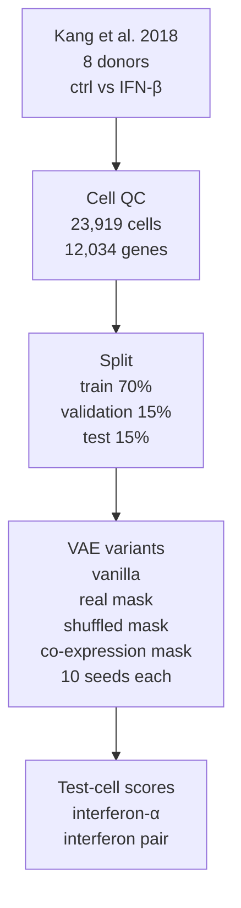
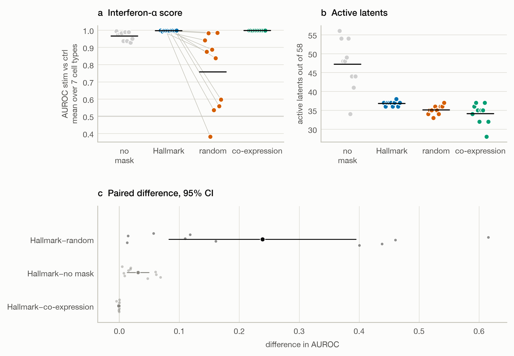
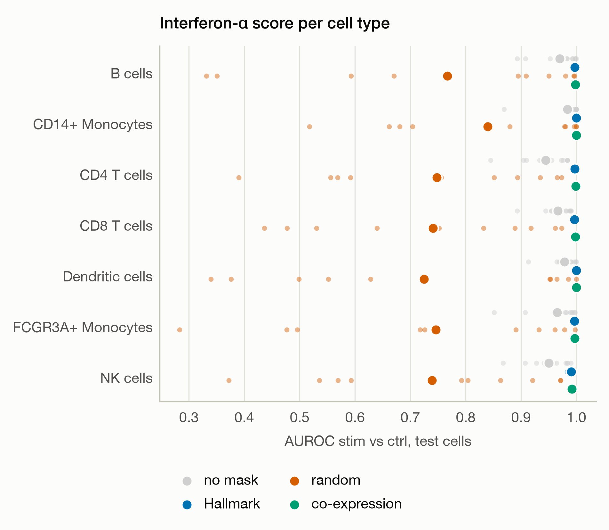
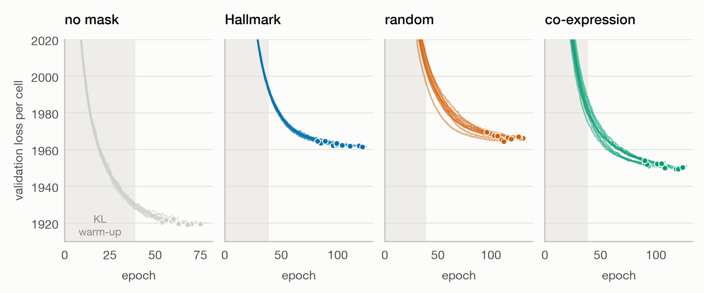
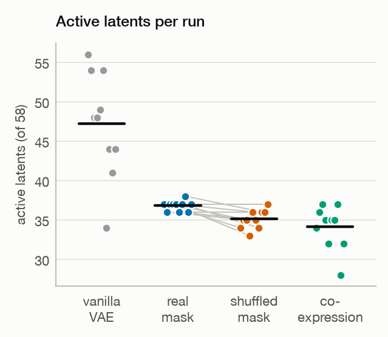

# Gene-set masks in a single-cell VAE: knowledge or sparsity?

Knowledge-guided single-cell models tie each latent factor to a gene set so that it reads as a biological programme.
For 29 *supervised* pathway-informed networks, structure-matched random pathways perform as well as real ones [1].
This project asks two questions about an *unsupervised* model, judging each by whether a named latent captures a
known programme.

- **Q1.** Does the knowledge in a gene-set mask help, or only the sparsity the mask imposes?
- **Q1b.** Is learning more data-efficient with real knowledge? Knowledge-guided models are argued to need fewer cells
  because they need not re-discover known patterns.

The model is a variational autoencoder (VAE) whose linear decoder is masked by Hallmark gene sets. It is fit to
peripheral blood mononuclear cells (PBMCs) with and without interferon-β (IFN-β) stimulation. The stimulation switches
on the type I interferon programme, a known answer that the interferon latent should recover. The real mask is
compared with the same sets after shuffling their gene labels, with a vanilla VAE and a co-expression mask as
references.

For Q1, the real mask put the stimulation response in its named interferon-α latent in all 10 seeds, while a
shuffled mask with the same structure did so unreliably. A co-expression mask did as well as the real one, but only the
labels reveal which of its latents carries the response.

## Background

Prior knowledge can enter a model in three ways [2]:

- as input features, such as gene-set or transcription-factor activity scores;
- in the architecture, as sparse or masked layers that mirror gene sets;
- as a graph of gene interactions.

This project tests the architecture route, because there the claim of interpretability by design is most direct. In a
masked linear decoder, latent k can reach only the genes of set k, so its value in a cell reads as the activity of that
gene set.

Several published models are built this way, and others use gene sets in related ways. Few compare real gene sets with
random ones. Only KPNN, a supervised network, replaces whole gene sets with random ones; MOFA-FLEX corrupts part of
each set.

| Model | Kind | Random gene-set control |
|---|---|---|
| VEGA [3], expiMap [4], pmVAE [5] | single-cell VAE with a masked decoder | none |
| f-scLVM [6], PLIER [7], Spectra [8] | linear factor model | none |
| KPNN [9] | supervised neural network | shuffled networks |
| MOFA-FLEX [10] | factor model | part of each gene set corrupted |
| Moullet et al. [11] | self-supervised model | none |

Earlier work leaves three questions open, and each one sets a part of the design.

- **Knowledge or sparsity?** A gene-set mask removes most decoder weights, so any gain over a vanilla model could come
  from the sparsity alone. A shuffled mask keeps every set's size and overlaps but not its biology, which isolates the
  effect of the knowledge.
- **Curated knowledge or any co-expression?** Curated gene sets align with the main axes of expression more than
  size-matched random sets do [12]. A real mask could therefore beat a shuffled one only because its genes are
  co-expressed. Modules of co-expressed genes of the same sizes test whether curation adds anything beyond that.
- **Less data needed?** expiMap integrated subsampled PBMC data better than the linear-decoder VAE LDVAE [13] when
  trained on few cells [4]. That comparison had no random-mask control and measured integration quality, not recovery
  of a known programme. Learning curves with all four variants test this directly (Q1b).

## Study design



The benchmark is four variants that share one architecture and one training setup, differ only in the decoder mask
and are each fit with 10 seeds. Baselines and structure-preserving controls are included because they often match
more complex or knowledge-based models [14–17]. Each variant answers a different part of the question.

| Variant | Decoder mask | Tests |
|---|---|---|
| Vanilla VAE (LDVAE [13]) | none | reference without knowledge |
| Real mask | Hallmark gene sets | knowledge + sparsity |
| Shuffled mask | Hallmark sets with gene labels permuted | sparsity alone |
| Co-expression mask | modules of co-expressed genes, same sizes | data-derived structure |

## Data

The data are from Kang et al. [18] (GEO GSE96583, batch 2). PBMCs from 8 donors were cultured for 6 h without (ctrl)
or with interferon-β (stim), and each condition was pooled and sequenced in one 10x run. Every donor appears in both
conditions. The authors' genotype-based singlet calls (demuxlet) and cell-type labels are used as given.

| Step | What is done | Result |
|---|---|---|
| Cell quality control (QC) | cells beyond 5 median absolute deviations in log total counts, log detected genes or share of counts in the top 20 genes are removed, following [19] and computed with scanpy [20], with thresholds per condition × cell type | 24,673 labelled singlets → 23,919 cells (3.1% removed, 1–6% per cell type) |
| Gene filter | genes detected in ≥ 20 cells are kept, and all of them are modelled | 12,034 genes |
| Split | cells are split within every donor × condition × cell type group | 70% train, 15% validation, 15% test |

Three choices differ from a default pipeline.

- **QC thresholds per cell type.** Thresholds per condition alone flagged up to 27% of monocytes, dendritic cells and
  megakaryocytes, whose RNA profiles differ from those of lymphocytes.
- **All genes instead of highly variable genes.** Selecting 5,000 highly variable genes drops interferon-induced genes
  such as PSMB9 and B2M and a third of the Hallmark interferon-α set.
- **No ambient-RNA correction or mitochondrial filter.** No empty droplets are deposited, and mitochondrial genes have
  no counts in the deposited matrices.

## Gene sets and masks

The real mask uses the Hallmark collection [21] from MSigDB v2024.1. It has 50 sets of at least 12 genes (median
117.5) and no near-duplicate sets: the largest overlap, between the early and late estrogen responses, is a Jaccard
index of 0.34. Its one unambiguous target for this data is the interferon-α response, with 95 of its 97 genes present.
Gene symbols are matched through Ensembl IDs to current symbols of the HUGO Gene Nomenclature Committee (HGNC) [22].

Two nulls replace the Hallmark sets with sets of the same sizes. Each is built 10 times, and the run with seed k uses
version k.

- **Shuffled mask** (`04_build_masks.py`). Genes are put into 25 bins of equal size (481–482 genes) by their mean
  count in training cells. Gene labels are then permuted within each bin, so each gene takes over the set memberships
  of another gene from its bin. Every set keeps its size, its overlaps with other sets and its expression level, and
  only its biology changes. A full shuffle changes 98% of set members; the rest land on a member of their own set.
- **Co-expression mask** (`05_build_coexpression_null.py`). This null asks whether curated sets add anything beyond
  genes that are simply expressed together. The modules are built from the data alone, without condition or cell-type
  labels.

  1. **Expression.** Training cells only, stimulated and control together. Counts are scaled to the median total
     count and log-transformed (ln(1 + x)), the same transform the encoder reads.
  2. **Correlation.** Pearson correlation between all 12,034 genes. A gene with no variance in training cells has
     correlation 0 with every other gene.
  3. **Seed genes.** For each seed, 50 distinct seed genes are drawn at random from the 6,753 genes detected in ≥ 1%
     of training cells. Rarer genes are excluded, because their nearest neighbours are noise.
  4. **Modules.** Module j is seed gene j plus the n − 1 genes most positively correlated with it, where n is the
     size of Hallmark set j (12–197 genes). Module j takes only the size of Hallmark set j, not its biology, so its
     latent is called "module j". Modules are built independently and may share genes.

  Three properties of the modules matter for reading the results.

  - **Coherence.** The median within-set correlation is 0.096 for modules and 0.003 for Hallmark sets. In single
    PBMCs most members of a Hallmark set barely co-vary, while a module is built to co-vary, so the null is a
    demanding competitor.
  - **Overlap.** Modules have the same 5,568 memberships as the Hallmark sets but cover 2,338–3,233 genes (Hallmark:
    3,187). The overlap concentrates on genes correlated with many others. Ribosomal-protein genes (RPS6, RPL3, …)
    and PTMA are in up to 28 modules per seed, whereas no Hallmark gene is in more than 10 sets. Several modules
    therefore partly describe the same ribosomal axis. The 8 free latents reach the 8,801–9,696 genes in no module.
  - **Interferon.** The modules were checked against the stimulation labels after they were built. In every seed,
    the module most raised by IFN-β is enriched for Hallmark interferon genes: 19–89% of its genes, against a base
    rate of 1.8%. In one seed it grew around UBE2L6 and contains ISG15, IFI6, IFIT1, IFIT3, MX1, IRF7 and OAS1. The
    data alone recover the core interferon response, so curated knowledge has to add more than that.

## Model

Every variant uses the same VAE, with a one-layer encoder and a masked linear decoder. In PyTorch it prints as follows.

```
VAE(
  (encoder): Sequential(
    (0): Linear(in_features=12042, out_features=128, bias=True)
    (1): ReLU()
    (2): Dropout(p=0.1, inplace=False)
  )
  (mean): Linear(in_features=128, out_features=58, bias=True)
  (log_var): Linear(in_features=128, out_features=58, bias=True)
)
```

The encoder input is the 12,034 genes after a shifted-log transform (below) plus a one-hot code for the 8 donors. The
decoder has no layers of its own, only the three parameters `w`, `v` and `log_theta` listed below.

| Parameter | Shape | Role | Count |
|---|---|---|---|
| encoder | 12,042 → 128 | hidden layer | 1,541,504 |
| mean, log_var | 128 → 58 (each) | posterior of the 58 latents | 14,964 |
| `w` | 12,034 × 58 | latent → gene weights, multiplied elementwise by the mask | 697,972 |
| `v` | 12,034 × 8 | donor offsets (also each gene's baseline) | 96,272 |
| `log_theta` | 12,034 | negative binomial dispersion per gene | 12,034 |
| **total** | | | **2,362,746** |

The mask decides how many of the 697,972 weights in `w` can be trained.

| Variant | Trainable decoder weights |
|---|---|
| Vanilla VAE | 697,972 (no mask) |
| Real mask | 76,344 (5,568 set memberships + 8 free latents × 8,847 genes in no set) |
| Shuffled mask | 76,344 (same sizes and overlaps as real) |
| Co-expression mask | 75,976–83,136 (by seed) |

The equations below follow one cell from its counts to the loss.

**Reading the cell.** The encoder first puts the cell's counts on a common scale. Each count x_g is divided by the
cell's total count ℓ, scaled to the median total m of the training cells and log-transformed, so deeply and shallowly
sequenced cells look alike.

$$\tilde{x}_g = \ln\big(1 + x_g \cdot m / \ell\big)$$

From these values and the donor code d, the encoder proposes where the cell sits in the latent space: a mean and a
variance for each of the 58 latents. This proposal is the posterior q(z | x, d). During training a point z is drawn
from it, and the evaluation uses its mean.

**Predicting the counts.** The decoder turns z back into expression. Each latent raises or lowers the genes that the
mask lets it reach, by its weights in w, and the donor adds its offsets v. A softmax over genes turns these scores
into shares that sum to 1: the fraction of the cell's counts each gene should receive.

$$\mathrm{share} = \mathrm{softmax}\big((w \odot \mathrm{mask})\,z + v\,d\big)$$

The expected count of gene g is the cell's total count times its share. The observed count scatters around it as a
negative binomial (NB), whose dispersion θ_g lets each gene be noisier than a Poisson count.

$$x_g \sim \mathrm{NB}\big(\mu_g = \ell \cdot \mathrm{share}_g,\ \theta_g\big)$$

**Scoring the fit.** The loss has two parts. The reconstruction term measures how unlikely the observed counts are
under the prediction. The Kullback–Leibler (KL) term pulls each cell's posterior towards a standard normal prior, which
keeps the latents on a common scale and lets latents the data do not need switch off.

$$\mathcal{L} = -\log p_{\mathrm{NB}}(x \mid \mu, \theta) + \beta \cdot \mathrm{KL}\big(q(z \mid x, d)\ \|\ \mathcal{N}(0, I)\big)$$

The weight β starts at 0, so the model first learns to reconstruct, and reaches 1 after ~38 epochs.

The terms, for one cell:

- **x̃_g, m**: the encoder's input for gene g, and the median total count of the training cells.
- **z**: the 58 latent values. During training they are drawn from the encoder's posterior
  q(z | x, d) = N(mean, exp(log_var)); the evaluation uses the posterior means.
- **d**: the donor one-hot code (8 values).
- **w**: the 12,034 × 58 latent → gene weights. **mask** has the same shape, with 1 where latent k may reach gene g
  and 0 elsewhere, and ⊙ multiplies the two elementwise.
- **v**: the 12,034 × 8 donor offsets, which also set each gene's baseline.
- **softmax**: taken over genes, so the shares are positive and sum to 1.
- **x_g**: the raw count of gene g. **ℓ** is the cell's total count, and **μ_g = ℓ · share_g** is the expected count.
- **θ_g**: the dispersion of gene g (`exp(log_theta)`). The variance of x_g is μ_g + μ_g² / θ_g.
- **−log p_NB(x | μ, θ)**: the reconstruction term, the negative log-likelihood summed over genes.
- **KL(q ‖ N(0, I))**: the KL divergence of the posterior from a standard normal prior, summed over
  latents.
- **β**: the KL weight. It rises linearly from 0 to 1 over the first ~38 epochs (KL warm-up) and then stays at 1.
- **ℒ**: the loss per cell, averaged over each batch. With β = 1 it is the negative evidence lower bound (ELBO).

Four design choices keep the variants comparable and the latents readable.

- **Linear decoder in every variant.** Each latent's effect on each gene is one weight, and the mask is the only
  architectural difference between variants.
- **Named and free latents.** In the masked variants, latents 1–50 may only use the genes of their set. The 8 free
  latents may only use the 8,847 genes in no set (74%). The free latents are kept off the set genes because, when they
  could reach all genes, they absorbed the stimulation signal and the named latents switched off.
- **Donor, not condition.** Donor is a covariate in encoder and decoder. Condition is never a covariate, because the
  stimulation is the signal the latents should find.
- **Likelihood.** Negative binomial on raw counts, with the observed total counts as library size and no zero
  inflation [23].

All variants are trained with the same settings.

| Setting | Value |
|---|---|
| Optimiser | Adam, learning rate 1e-3 |
| Batch size | 128 |
| Stopping | early stopping on validation loss with patience 3 epochs, counted after warm-up [15]; at most 2,000 epochs |
| Encoder width | 128, chosen on the vanilla VAE |
| Seeds | 10 per variant |

## Evaluation

The evaluation asks whether the latents capture the known answer. Both scores measure how well latents separate
stimulated from control test cells, as the area under the receiver operating characteristic curve (AUROC). The AUROC
is computed within each cell type, so a latent cannot score by separating cell types, and averaged unweighted over 7
cell types.

| Score | Latents | Read-out | Role |
|---|---|---|---|
| Interferon-α score | the interferon-α latent; for the vanilla VAE and co-expression mask, the best single latent | the oriented latent itself | primary |
| Interferon pair score | the interferon-α and -γ latents; for the vanilla VAE and co-expression mask, the best two latents | a logistic classifier on the two latents | secondary |

The pair score is included because the interferon-α and -γ sets share 71 of the α set's 95 genes, so the stimulation
signal may land in either latent. The rules below fix how latents are chosen and how scores are compared.

- **Labels.** Labels never enter training. Validation labels choose latents for the variants without meaningful names
  and train the classifier, and test labels are used only for the final scores.
- **Orientation.** A latent's sign is arbitrary. A masked latent is oriented without labels, so that its mean weight on
  its own genes is positive.
- **Latent choice without names.** In the vanilla VAE and the co-expression mask the latents have no meaningful names.
  Each active latent gets its AUROC on validation cells. The one with the largest max(AUROC, 1 − AUROC) is chosen,
  with the sign that gives AUROC > 0.5, and the pair score uses the best two by the same measure. This favours these
  two variants, which get the best of their active latents instead of one fixed latent.
- **Inactive latents.** A latent whose posterior means vary by ≤ 0.01 across validation cells gets an interferon-α
  score of 0.5.
- **Megakaryocytes.** They are excluded from the scores but kept in training, because they are mostly platelets, which
  have no nucleus.
- **Classifier.** The pair score uses a logistic classifier with an L2 penalty (C = 1), trained on all validation
  cells pooled over cell types. Latents are standardised by the validation mean and SD. Its predicted scores on test
  cells give the AUROCs within cell type.
- **Statistics.** Each variant has 10 seeds, paired by seed. The one primary test compares the interferon-α score of
  the real and shuffled masks. Real beats shuffled if the 95% paired t-interval of the difference excludes 0, and an
  exact two-sided Wilcoxon signed-rank test is reported alongside; with 10 pairs, its smallest possible p is 0.002.
  All other comparisons are secondary.

## Learning curves (Q1b)

The learning curves ask whether real knowledge helps more when cells are scarce. All four variants are refit on
smaller training sets and scored as above.

- **Training sizes.** 500, 1,000, 2,000, 4,000, 8,000 and all ~16,700 training cells, as nested subsamples stratified
  by donor × condition × cell type. Each seed has its own series of subsamples, shared by all four variants, so the
  comparison stays paired by seed and the seeds also cover the choice of cells. Validation and test sets stay fixed,
  and the full-size point is the main experiment.
- **Training.** KL warm-up over ~38 epochs, patience 3 epochs and learning rate 1e-3 at every size, with 10 seeds per
  variant and size.
- **Nulls.** Co-expression modules and shuffle expression bins are rebuilt on each subsample. With few cells,
  correlations are noisier: modules overlap less and cover ~4,100 genes at 500 cells.

## Results

All 40 runs (4 variants × 10 seeds) stopped early. In every run the latent behind the interferon-α score was active,
so the inactivity rule set no score to 0.5. Values are means ± SD over 10 seeds, and differences are paired by seed.

| Variant | Interferon-α score | Interferon pair score | Active latents (of 58) | Validation loss per cell |
|---|---|---|---|---|
| Vanilla VAE | 0.966 ± 0.025 | 0.988 ± 0.007 | 34–56 | 1,920 |
| Real mask | 0.997 ± 0.002 | 0.998 ± 0.0004 | 36–38 | 1,963 |
| Shuffled mask | 0.758 ± 0.218 | 0.871 ± 0.088 | 33–37 | 1,966 |
| Co-expression mask | 0.998 ± 0.0004 | 0.998 ± 0.0003 | 28–37 | 1,951 |



*(a, b) One dot per seed, bar at the mean; grey lines join real and shuffled runs of the same seed; hollow dots mark
inactive latents (none here). (c) Mean paired difference with 95% t-interval; the primary comparison in black.*

**Q1: the real mask places the stimulation response in its named latent.** The interferon-α latent of the real mask
separated stimulated from control test cells almost perfectly (0.997 ± 0.002). Under the shuffled mask, the latent at
the same position scored 0.758 ± 0.218, between 0.38 and 0.98 depending on the seed. Both masks share every set's
size, overlaps and expression level, so they differ only in which genes each set holds. The real mask scored higher
in all 10 seeds, by +0.239 (95% paired t-interval +0.083 to +0.395; Wilcoxon signed-rank p = 0.002). The knowledge
in the mask, not its sparsity, therefore carries the response into the named latent. In the lowest shuffled seed
(0.38), the latent ranked control cells above stimulated cells. Its sign, set by its own decoder weights, pointed
away from the response.

| Comparison | Interferon-α score | Interferon pair score |
|---|---|---|
| Real − shuffled | +0.239 (+0.083 to +0.395), p = 0.002 | +0.126 (+0.063 to +0.189), p = 0.002 |
| Real − vanilla | +0.031 (+0.013 to +0.049), p = 0.002 | +0.009 (+0.004 to +0.014), p = 0.004 |
| Real − co-expression mask | −0.0009 (−0.0020 to +0.0002), p = 0.04 | 0.0000 (−0.0003 to +0.0003), p = 0.85 |

Mean difference, 95% paired t-interval and Wilcoxon signed-rank p over 10 seeds.

The reference variants also scored highly, but only through latents chosen on validation labels.

- **Vanilla VAE.** Its best latent scored 0.966 ± 0.025, and the real mask scored higher in all 10 seeds (+0.031,
  95% interval +0.013 to +0.049).
- **Co-expression mask.** Its best module matched the real mask at 0.998 ± 0.0004. It led by about 0.001 in 7 of 10
  seeds, with an interval that included zero (−0.0009, −0.0020 to +0.0002; Wilcoxon p = 0.04). Modules built from the
  data capture the response as well as curated sets do, but the module has to be found with labels. The real mask
  names its latent before training.
- **Pair score.** Combining the α and γ latents raised the shuffled mask to 0.871 ± 0.088, still below the real mask
  in all 10 seeds (+0.126, +0.063 to +0.189). The vanilla VAE (0.988) and co-expression mask (0.998) kept their order.



*Small dots: single seeds; large dots: means over 10 seeds.*

The result held in every cell type. The real mask reached at least 0.991 in each of the 7 cell types, with NK cells
lowest. The shuffled mask averaged between 0.73 and 0.84 in each cell type, so its loss was not confined to one.



*One line per seed; dots mark the best epoch; shading marks the KL warm-up.*

The masks cost reconstruction. Validation loss per cell was 1,920 for the vanilla VAE and 1,951–1,966 for the masked
variants. Real and shuffled masks, with the same sparsity, differed by about 4. The co-expression mask reconstructed
better than either. The masked variants also kept fewer latents active, 34–37 of 58 on average against 47 for the
vanilla VAE.



*A latent counts as active if its posterior means vary by more than 0.01 across validation cells.*

## Conclusion

The answer to Q1 is the knowledge. In an unsupervised VAE of IFN-β-stimulated PBMCs, a Hallmark mask placed the
stimulation response in the named interferon-α latent in every seed. A shuffled mask with identical structure did so
unreliably, and in one seed with the opposite sign. Supervised pathway-informed networks perform as well with random
pathways [1]. Here the measure is whether a named latent carries a known programme, and on that measure real gene
sets matter.

Curation added the name, not the signal. A co-expression mask built from correlation alone captured the response
equally well, but its latent had to be found with labels, whereas the real mask named it before training.

These results come from one dataset, one gene-set collection and one programme with a very strong signal. Q1b asks
whether the advantage of real knowledge grows when cells are scarce.

## Biology in the code

Each choice below builds biological knowledge or an assumption about the cells into the pipeline.

| Step | Script | Choice | Reason |
|---|---|---|---|
| Cell identity | `03` | the authors' demuxlet singlet calls and cell-type labels, used as given | genotype-based calls are independent of expression |
| Cell QC | `03` | thresholds per condition × cell type | monocytes, dendritic cells and megakaryocytes differ in RNA content, and stimulation shifts it |
| Genes | `03` | all genes detected in ≥ 20 cells; no highly-variable-gene selection | selection drops interferon-induced genes |
| Split | `03` | stratified by donor × condition × cell type | every group appears in train, validation and test |
| Gene identity | `04` | Ensembl IDs mapped to current HGNC symbols (1,256 symbols changed since 2017; 427 genes HGNC no longer lists keep their 2017 symbol) | gene-set symbols are current |
| Gene sets | `04` | Hallmark, sets of ≥ 12 genes (all 50) | one unambiguous target, the interferon-α response |
| Shuffled null | `04` | labels permuted within expression bins | random genes are as highly expressed as the genes they replace |
| Co-expression mask | `05` | modules of correlated genes, sizes matched to Hallmark | see Gene sets and masks |
| Free latents | `06` | reach only genes in no set | when they reached all genes, they absorbed the stimulation signal |
| Covariates | `06` | donor in encoder and decoder; condition never | the stimulation is the signal the latents should find |
| Likelihood | `06` | negative binomial on raw counts, observed total counts as library size | droplet counts are not zero-inflated [23] |
| Target latent | `08` | HALLMARK_INTERFERON_ALPHA_RESPONSE; with HALLMARK_INTERFERON_GAMMA_RESPONSE for the pair | IFN-β is a type I interferon; the γ set shares 71 of the α set's 95 genes |
| Orientation | `08` | sign set so the latent's mean weight on its own genes is positive | an active programme raises its genes |
| Scoring | `08` | AUROC within cell type, unweighted mean over 7 types | every cell type responds to IFN-β, and cell types should not score by themselves |
| Megakaryocytes | `08` | excluded from scores, kept in training | mostly platelets, which have no nucleus |
| Subsamples | `learning_curves/01` | stratified by donor × condition × cell type; nulls rebuilt per subsample | no null sees more cells than its model |

## Reproducing

The pipeline runs from a fresh virtual environment, one script per stage.

```
python3 -m venv .venv
.venv/bin/pip install -r requirements.txt
.venv/bin/python src/01_download_kang.py
.venv/bin/python src/02_download_genesets.py
.venv/bin/python src/03_preprocess_kang.py
.venv/bin/python src/04_build_masks.py
.venv/bin/python src/05_build_coexpression_null.py
bash src/07_experiment.sh
.venv/bin/python src/08_evaluate.py
.venv/bin/python src/09_figures.py
```

The learning curves run after the main experiment and add their own tables and figure.

```
.venv/bin/python src/learning_curves/01_subsample.py
bash src/learning_curves/02_run.sh
.venv/bin/python src/08_evaluate.py --learning-curves
.venv/bin/python src/09_figures.py
```

| Path | Contents |
|---|---|
| `src/` | one script per stage, in run order; `06_fit.py` trains one model per call and is run by `07_experiment.sh` |
| `src/learning_curves/` | training subsamples and the runs on them (Q1b) |
| `notebooks/hvg_inspection.py` | highly-variable-gene analysis behind the choice to model all genes |
| `data/`, `results/` | created by the scripts, not tracked |
| `reports/tables/` | scores per run, AUROCs per cell type and paired comparisons |
| `reports/figures/` | figures |

## Future work

The same comparison can be extended to harder questions and other data.

- **Q2 (known regulators).** Do the explanations recover known regulators? In B cell → plasma cell differentiation
  PRDM1, IRF4 and XBP1 go up and PAX5 and BACH2 go down, and IRF4 and PRDM1 knockouts give perturbation ground
  truth [24, 25].
- **Q3 (protein as reference).** Does RNA-based pathway activity agree with CITE-seq surface protein, an independent
  measurement? RNA–protein correlation is weak, so protein is a noisy reference [25].
- **Q4 (imperfect gene sets).** What is the cost of incomplete or species-transferred gene sets, for example human sets
  applied to mouse gastrulation data [26]? And does a soft mask started from random sets refine to the same
  programmes?
- **Reactome.** Reactome [27] as a second gene-set collection on the Kang data, as used there by [3, 4, 28].

Candidate datasets for each question are listed below.

| Question | Dataset | Access |
|---|---|---|
| Q1, Q1b | Kang et al. 2018 [18] | GEO GSE96583 (batch 2) |
| Q1, Q2 | Human tonsil atlas, B cell compartments [25] | Zenodo 10.5281/zenodo.8373756 |
| Q2 | B cell time course with IRF4 / PRDM1 CRISPR [24] | Zenodo 10.5281/zenodo.17984776 |
| Q3 | Tonsil CITE-seq [25]; 10x `pbmc_10k_protein_v3` | Zenodo 10.5281/zenodo.8373756; 10x Genomics |
| Q4 | Mouse gastrulation [26] | ArrayExpress E-MTAB-6967 |

## References
1. Caranzano I, et al. Sparsity is all you need: rethinking biologically informed neural networks. *Brief Bioinform*
   (2026). [doi:10.1093/bib/bbag425](https://doi.org/10.1093/bib/bbag425)
2. Thapa K, et al. Strategies to include prior knowledge in omics analysis with deep neural networks. *Patterns*
   (2025). [doi:10.1016/j.patter.2025.101203](https://doi.org/10.1016/j.patter.2025.101203)
3. Seninge L, et al. VEGA is an interpretable generative model for inferring biological network activity in
   single-cell transcriptomics. *Nat Commun* (2021).
   [doi:10.1038/s41467-021-26017-0](https://doi.org/10.1038/s41467-021-26017-0)
4. Lotfollahi M, et al. Biologically informed deep learning to query gene programs in single-cell atlases.
   *Nat Cell Biol* (2023). [doi:10.1038/s41556-022-01072-x](https://doi.org/10.1038/s41556-022-01072-x)
5. Gut G, et al. pmVAE: learning interpretable single-cell representations with pathway modules. *bioRxiv* (2021).
   [doi:10.1101/2021.01.28.428664](https://doi.org/10.1101/2021.01.28.428664)
6. Buettner F, et al. f-scLVM: scalable and versatile factor analysis for single-cell RNA-seq. *Genome Biol* (2017).
   [doi:10.1186/s13059-017-1334-8](https://doi.org/10.1186/s13059-017-1334-8)
7. Mao W, et al. Pathway-level information extractor (PLIER) for gene expression data. *Nat Methods* (2019).
   [doi:10.1038/s41592-019-0456-1](https://doi.org/10.1038/s41592-019-0456-1)
8. Kunes RZ, et al. Supervised discovery of interpretable gene programs from single-cell data. *Nat Biotechnol*
   (2024). [doi:10.1038/s41587-023-01940-3](https://doi.org/10.1038/s41587-023-01940-3)
9. Fortelny N, Bock C. Knowledge-primed neural networks enable biologically interpretable deep learning on
   single-cell sequencing data. *Genome Biol* (2020).
   [doi:10.1186/s13059-020-02100-5](https://doi.org/10.1186/s13059-020-02100-5)
10. Qoku A, et al. MOFA-FLEX: a factor model framework for integrating omics data with prior knowledge. *bioRxiv*
    (2025). [doi:10.1101/2025.11.03.686250](https://doi.org/10.1101/2025.11.03.686250)
11. Moullet M, et al. Self-supervised learning for a gene program-centric view of cell states. *bioRxiv* (2026).
    [doi:10.64898/2026.03.24.713961](https://doi.org/10.64898/2026.03.24.713961)
12. Zhu Y, et al. A residual-ratio framework for auditing transcriptomic gene signatures against background
    expression structure. *bioRxiv* (2026). [doi:10.64898/2026.04.11.717907](https://doi.org/10.64898/2026.04.11.717907)
13. Svensson V, et al. Interpretable factor models of single-cell RNA-seq via variational autoencoders.
    *Bioinformatics* (2020). [doi:10.1093/bioinformatics/btaa169](https://doi.org/10.1093/bioinformatics/btaa169)
14. Villegas-Morcillo A, et al. Unsupervised protein embeddings outperform hand-crafted sequence and structure
    features at predicting molecular function. *Bioinformatics* (2021).
    [doi:10.1093/bioinformatics/btaa701](https://doi.org/10.1093/bioinformatics/btaa701)
15. Eltager M, et al. Benchmarking variational autoencoders on cancer transcriptomics data. *PLoS One* (2023).
    [doi:10.1371/journal.pone.0292126](https://doi.org/10.1371/journal.pone.0292126)
16. Makrodimitris S, et al. An in-depth comparison of linear and non-linear joint embedding methods for bulk and
    single-cell multi-omics. *Brief Bioinform* (2024). [doi:10.1093/bib/bbad416](https://doi.org/10.1093/bib/bbad416)
17. Ahlmann-Eltze C, et al. Deep-learning-based gene perturbation effect prediction does not yet outperform simple
    linear baselines. *Nat Methods* (2025). [doi:10.1038/s41592-025-02772-6](https://doi.org/10.1038/s41592-025-02772-6)
18. Kang HM, et al. Multiplexed droplet single-cell RNA-sequencing using natural genetic variation. *Nat Biotechnol*
    (2018). [doi:10.1038/nbt.4042](https://doi.org/10.1038/nbt.4042)
19. Heumos L, et al. Best practices for single-cell analysis across modalities. *Nat Rev Genet* (2023).
    [doi:10.1038/s41576-023-00586-w](https://doi.org/10.1038/s41576-023-00586-w)
20. Wolf FA, et al. SCANPY: large-scale single-cell gene expression data analysis. *Genome Biol* (2018).
    [doi:10.1186/s13059-017-1382-0](https://doi.org/10.1186/s13059-017-1382-0)
21. Liberzon A, et al. The Molecular Signatures Database (MSigDB) hallmark gene set collection. *Cell Syst* (2015).
    [doi:10.1016/j.cels.2015.12.004](https://doi.org/10.1016/j.cels.2015.12.004)
22. Seal RL, et al. Genenames.org: the HGNC resources in 2023. *Nucleic Acids Res* (2023).
    [doi:10.1093/nar/gkac888](https://doi.org/10.1093/nar/gkac888)
23. Svensson V. Droplet scRNA-seq is not zero-inflated. *Nat Biotechnol* (2020).
    [doi:10.1038/s41587-019-0379-5](https://doi.org/10.1038/s41587-019-0379-5)
24. Demela P, et al. Competing gene regulatory networks drive naive and memory B cell differentiation. *Mol Syst Biol*
    (2026). [doi:10.1038/s44320-026-00207-8](https://doi.org/10.1038/s44320-026-00207-8)
25. Massoni-Badosa R, et al. An atlas of cells in the human tonsil. *Immunity* (2024).
    [doi:10.1016/j.immuni.2024.01.006](https://doi.org/10.1016/j.immuni.2024.01.006)
26. Pijuan-Sala B, et al. A single-cell molecular map of mouse gastrulation and early organogenesis. *Nature* (2019).
    [doi:10.1038/s41586-019-0933-9](https://doi.org/10.1038/s41586-019-0933-9)
27. Milacic M, et al. The Reactome Pathway Knowledgebase 2024. *Nucleic Acids Res* (2024).
    [doi:10.1093/nar/gkad1025](https://doi.org/10.1093/nar/gkad1025)
28. Doncevic D, Herrmann C. Biologically informed variational autoencoders allow predictive modeling of genetic and
    drug-induced perturbations. *Bioinformatics* (2023).
    [doi:10.1093/bioinformatics/btad387](https://doi.org/10.1093/bioinformatics/btad387)
