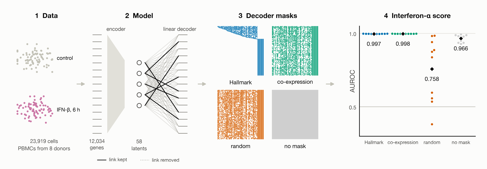
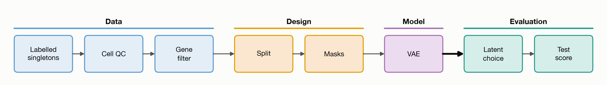
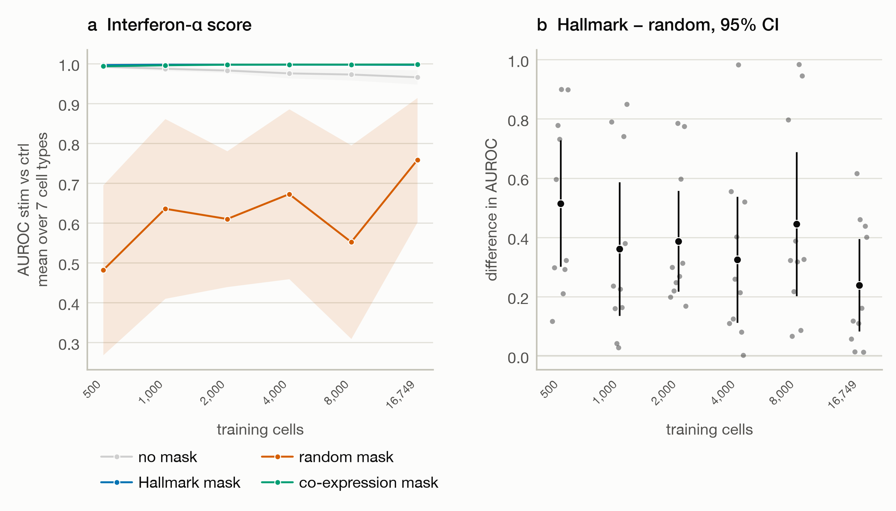

# Gene set masks in a single-cell VAE: knowledge or sparsity?

In knowledge-guided single-cell models, each latent variable (a hidden factor that the model infers for every cell) is tied
to a gene set. Its value then reads as the activity of a known pathway.
In 29 pathway-informed neural networks trained for prediction, randomized models that kept the sparsity and architecture of the originals matched or outperformed them [1].
This project asks two questions about an *unsupervised* model, judging each by whether a named latent captures a
known biological response.

- **Q1.** Does the knowledge in a gene set mask help, or only the sparsity the mask imposes?
- **Q1b.** Is learning more data-efficient with Hallmark knowledge? Knowledge-guided models are expected to need fewer cells
  because they need not re-discover known patterns.

Four variants of one variational autoencoder (VAE) with a linear decoder are compared. They differ only in the decoder
mask: Hallmark gene sets, the same sets with their gene labels shuffled, modules of co-expressed genes of the same
sizes, or no mask. Each is fit to peripheral blood mononuclear cells (PBMCs) with and without interferon-β (IFN-β)
stimulation. The stimulation switches on a known set of interferon-stimulated genes (ISGs, the type I interferon response),
which the interferon-α latent should recover.

The interferon-α score is the area under the receiver operating characteristic curve (AUROC) of the interferon-α latent in
separating stimulated from control cells. In Q1, the Hallmark mask scored above 0.99 in all 10 seeds. The latent of a random
mask with the same structure ranged from 0.38 to 0.98 at that position, yet the random mask did encode the response, in
another latent with the wrong name. A co-expression mask matched the Hallmark mask (0.998 vs 0.997). Curation gave the latent a name and, compared with co-expression modules, no measurable signal. In Q1b, the Hallmark mask scored 0.996 with only 500 cells. The no-mask and
co-expression variants came within 0.004 of it.

## Background

Prior knowledge can enter a model in three ways [2]:

- as input features, such as gene set or transcription-factor activity scores;
- in the architecture, as sparse or masked layers that mirror gene sets;
- as a graph of gene interactions.

This project tests the architecture route, where the claim of interpretability by design is most direct. A masked linear
decoder lets latent k reach only the genes of set k. Its value in a cell then reads as the activity of that gene set.

Several published models are built this way, and others use gene sets in related ways. VEGA [3] and expiMap [4], which both evaluate on interferon-β-stimulated PBMCs, report masked decoders without a random gene set control. The closest control, in MOFA-FLEX [10], swaps 30% of the genes of each set with random non-members and tests whether the original programs are recovered.

| Model | Kind |
|---|---|
| VEGA [3], expiMap [4] | single-cell VAE with a masked decoder |
| pmVAE [5] | single-cell VAE with one sub-network per pathway |
| f-scLVM [6], PLIER [7], Spectra [8] | factor model |
| KPNN [9] | supervised neural network |
| MOFA-FLEX [10] | factor model |
| Moullet et al. [11] | self-supervised model |

Earlier work leaves three questions open, and each shapes the design.

- **Knowledge or sparsity?** A gene set mask fixes 89% of the decoder weights at zero. Any gain over a model without a mask could
  come from the sparsity alone. A random mask keeps the size and overlaps of every set and changes only its
  biology. It isolates the effect of the knowledge.
- **Curated knowledge or any co-expression?** Curated gene sets align with the main axes of expression more than
  size-matched random sets do in bulk tumour data [12]. A Hallmark mask could beat a random one only because its genes are
  co-expressed. Modules of co-expressed genes of the same sizes test whether curation adds anything beyond that.
- **Less data needed?** expiMap was reported to learn more sample-efficiently than the linear-decoder VAE LDVAE [13] when fewer training samples were available [4]. That comparison did not include a random gene set control. Knowledge and sparsity were confounded. Learning curves with all four
  variants test this directly (Q1b).

## Study design


*Stage 3 shows the decoder mask of each variant as trained with seed 0: rows are the 12,034
genes sorted by Hallmark membership, columns are the 58 latents, and each dot is a kept link between a gene and a latent.
Stage 4 shows the interferon-α score of the scored latent in all 10 seeds, with the mean printed under each
variant.*

The benchmark is four variants that share one architecture and one training setup, differ only in the decoder mask
and are each fit with 10 seeds. Baselines and structure-preserving controls are included because randomized pathways and simple baselines can match more elaborate models [1, 15, 16].

| Variant | Decoder mask | Tests |
|---|---|---|
| No mask (vanilla VAE, LDVAE [13]) | none | reference without knowledge |
| Hallmark mask | Hallmark gene sets | knowledge + sparsity |
| Random mask | Hallmark sets with gene labels randomly permuted | sparsity alone |
| Co-expression mask | modules of co-expressed genes, same sizes | data-derived structure |

The pipeline has eight steps: data (blue), design (orange), model (purple) and evaluation (teal).



## Data

The data are from Kang et al. [17] (GEO GSE96583, batch 2). PBMCs from 8 patients with systemic lupus erythematosus
(SLE; GEO lists "subject status: SLE patient" for both samples; called donors below) were cultured for 6 h without (ctrl)
or with interferon-β (stim), and each condition was pooled and sequenced in one 10x run. Every donor appears in both
conditions. The authors' genotype-based singlet calls (demuxlet) and cell-type labels are used as given.

| Step | What is done | Result |
|---|---|---|
| Cell quality control (QC) | cells beyond 5 median absolute deviations in log total counts, log detected genes or share of counts in the top 20 genes are removed, following [18] and computed with scanpy [19], with thresholds per condition × cell type | 24,673 labelled singlets → 23,919 cells (3.1% removed; 0.8–5.0% per cell type, 20.8% of megakaryocytes) |
| Gene filter | genes detected in ≥ 20 cells are kept, and all of them are modelled | 12,034 genes |
| Split | cells are split within every donor × condition × cell type group | 70% train, 15% validation, 15% test |

Three preprocessing choices were made for this data set.

- **QC thresholds per cell type.** Thresholds per condition alone removed 5–7% of CD14+ monocytes, 9–18% of dendritic cells and 20–27% of
  megakaryocytes but under 2% of lymphocytes. The RNA profiles of these cell types differ from those of lymphocytes.
- **All genes instead of highly variable genes.** Selecting 5,000 highly variable genes drops interferon-induced genes
  such as PSMB9 and B2M and a third of the Hallmark interferon-α set.
- **No ambient-RNA correction or mitochondrial filter.** The data set has no empty droplets to estimate ambient RNA from, and mitochondrial genes have
  no counts in the count matrices.

## Gene sets and masks

The Hallmark mask uses the Hallmark collection [20] from MSigDB v2024.1. It has 50 sets of at least 12 genes (median
117.5) and no near-duplicate sets: the largest overlap, between the early and late estrogen responses, is a Jaccard
index of 0.34. Its one unambiguous target for this data is the interferon-α response, with 95 of its 97 genes present.
Gene symbols are matched through Ensembl IDs to current symbols of the HUGO Gene Nomenclature Committee (HGNC) [21].

Two null masks (negative controls) replace the Hallmark sets with sets of the same sizes. Each is built 10 times, and the run with seed k uses
version k.

- **Random mask** (`04_build_masks.py`). Genes are put into 25 bins of equal size (481–482 genes) by their mean
  count in training cells. Gene labels are then permuted within each bin: each gene takes over the set memberships
  of another gene from its bin. Every set keeps its size, its overlaps with other sets and its expression level. Only
  its biology changes. A full shuffle changes 98% of set members; the rest land on a member of their own set.
- **Co-expression mask** (`05_build_coexpression_null.py`). This null tests whether curated sets add anything beyond
  co-expressed genes. The modules are built from the data alone, without condition or cell-type
  labels.

  1. **Expression.** Training cells only, stimulated and control together. Counts are scaled to the median total
     count and log-transformed (ln(1 + x)), the same transform the encoder reads.
  2. **Correlation.** Pearson correlation between all 12,034 genes. A gene with no variance in training cells has
     correlation 0 with every other gene.
  3. **Seed genes.** For each seed, 50 distinct seed genes are drawn at random from the 6,753 genes detected in ≥ 1%
     of training cells. The nearest neighbours of rarer genes are noise, and these genes are excluded.
  4. **Modules.** Module j is seed gene j plus the n − 1 genes most positively correlated with it, where n is the
     size of Hallmark set j (12–197 genes). Module j takes the size of Hallmark set j and none of its biology. Its
     latent is called "module j". Modules are built independently and may share genes.

  The modules have three properties that affect how the results are read.

  - **Coherence.** The median within-set correlation is 0.096 for modules and 0.003 for Hallmark sets. In single
    PBMCs most members of a Hallmark set barely co-vary. A module, in contrast, is built to co-vary. This null is
    therefore a strong comparison.
  - **Overlap.** Modules have the same 5,568 memberships as the Hallmark sets but cover 2,338–3,233 genes (Hallmark:
    3,187). The overlap concentrates on genes correlated with many others. Ribosomal-protein genes (RPS6, RPL3, …)
    and PTMA are in up to 28 modules per seed. No Hallmark gene is in more than 10 sets. Several modules
    partly describe the same ribosomal axis. The 8 free latents reach the 8,801–9,696 genes in no module.
  - **Interferon.** The modules were checked against the stimulation labels after they were built. In every seed,
    the module most raised by IFN-β is enriched for Hallmark interferon genes: 19–89% of its genes, against a base
    rate of 1.8%. In one seed it grew around UBE2L6 and contains ISG15, IFI6, IFIT1, IFIT3, MX1, IRF7 and OAS1. The
    data alone recover the core interferon response.

## Model

Every variant uses the same VAE, with an encoder of one hidden layer and a linear decoder (binary mask on its weight matrix in three of the four variants). In PyTorch it prints as follows.

```
VAE(
  (encoder): Sequential(
    (0): Linear(in_features=12042, out_features=128, bias=True)
    (1): ReLU()
    (2): Dropout(p=0.1, inplace=False)
  )
  (mean): Linear(in_features=128, out_features=58, bias=True)
  (log_var): Linear(in_features=128, out_features=58, bias=True)
)
```

The encoder input is the 12,034 genes after a shifted-log transform (below) plus a one-hot code for the 8 donors. The
decoder has no layers of its own, only the three parameters $W$, $V$ and $\log\theta$ (`w`, `v` and `log_theta` in the code).

| Parameter | Shape | Role | Count |
|---|---|---|---|
| encoder | 12,042 → 128 | hidden layer | 1,541,504 |
| mean, log_var | 128 → 58 (each) | mean and log-variance of the posterior $q(z \mid x, d)$ | 14,964 |
| $W$ (`w`) | 12,034 × 58 | latent → gene weights, multiplied elementwise by the mask $M$ | 697,972 |
| $V$ (`v`) | 12,034 × 8 | donor offsets (also each gene's baseline) | 96,272 |
| $\log\theta$ (`log_theta`) | 12,034 | negative binomial dispersion per gene | 12,034 |
| **total** | | | **2,362,746** |

The mask decides how many of the 697,972 weights in `w` can be trained.

| Variant | Trainable decoder weights |
|---|---|
| No mask | 697,972 |
| Hallmark mask | 76,344 (5,568 set memberships + 8 free latents × 8,847 genes in no set) |
| Random mask | 76,344 (same sizes and overlaps as the Hallmark mask) |
| Co-expression mask | 75,976–83,136 (by seed) |

The encoder first puts the counts of a cell on a common scale. Each count $x_g$ is divided by the
total count of the cell $\ell$, multiplied by the median total $m$ of the training cells and log-transformed. Deeply and
shallowly sequenced cells then look alike.

$$\tilde{x}_g = \ln\big(1 + x_g \cdot m / \ell\big)$$

The encoder reads $\tilde{x}$ and the donor code $d$ and proposes where the cell sits in the latent space, as a mean and a
variance for each of the 58 latents. This proposal is the posterior $q(z \mid x, d)$. Training draws a point $z$ from it;
the evaluation uses its mean.

The decoder turns $z$ back into expression. Each latent raises or lowers the genes that the
mask $M$ lets it reach, through its weights $W$, and the donor adds its offsets $V$. A softmax over genes converts these
scores into shares $\pi_g$ that sum to 1, the fraction of the counts of the cell that each gene should receive.

$$\pi = \mathrm{softmax}\big((W \odot M)\,z + V\,d\big)$$

The expected count of gene $g$ is the total count of the cell times its share. The observed count scatters around it as a
negative binomial (NB). The dispersion $\theta_g$ allows each gene to be noisier than a Poisson count.

$$x_g \sim \mathrm{NB}\big(\mu_g = \ell \cdot \pi_g,\ \theta_g\big)$$

The loss has two parts. The reconstruction term measures how unlikely the observed counts are under
the prediction. The Kullback–Leibler (KL) term pulls the posterior of each cell towards a standard normal prior. This
keeps the latents on a common scale and lets those that the data do not need switch off.

$$\mathcal{L} = -\log p_{\mathrm{NB}}(x \mid \mu, \theta) + \beta \cdot \mathrm{KL}\big(q(z \mid x, d)\ \|\ \mathcal{N}(0, I)\big)$$

The weight $\beta$ starts at 0, so the model first learns to reconstruct. It reaches 1 after ~38 epochs.

The terms, for one cell:

- $x_g$, $\tilde{x}_g$: the raw count of gene $g$ and its encoder input. $\ell = \sum_g x_g$ is the total count of the cell
  and $m$ the median total count of the training cells.
- $d \in \{0,1\}^{8}$: the donor one-hot code.
- $z \in \mathbb{R}^{58}$: the latent values. Training draws them from
  $q(z \mid x, d) = \mathcal{N}\big(\mathrm{mean},\ \mathrm{diag}\,\exp(\mathrm{log\_var})\big)$; the evaluation uses the
  posterior means.
- $W \in \mathbb{R}^{12034 \times 58}$: the latent → gene weights (`w` in the code). $M \in \{0,1\}^{12034 \times 58}$ is
  the mask, with 1 where latent $k$ may reach gene $g$ and 0 elsewhere. The product $\odot$ is elementwise.
- $V \in \mathbb{R}^{12034 \times 8}$: the donor offsets (`v`), which also set the baseline of each gene.
- $\pi_g$: the share of gene $g$. The softmax is taken over genes, so the shares are positive and sum to 1.
- $\mu_g = \ell\,\pi_g$: the expected count of gene $g$.
- $\theta_g$: the dispersion of gene $g$ (`exp(log_theta)`), with $\mathrm{Var}(x_g) = \mu_g + \mu_g^2 / \theta_g$.
- $-\log p_{\mathrm{NB}}(x \mid \mu, \theta)$: the reconstruction term, the negative log-likelihood summed over genes.
- $\mathrm{KL}\big(q \,\|\, \mathcal{N}(0, I)\big)$: the KL divergence of the posterior from the standard normal prior,
  summed over latents.
- $\beta$: the KL weight. It rises linearly from 0 to 1 over the first ~38 epochs (KL warm-up) and then stays at 1.
- $\mathcal{L}$: the loss per cell, averaged over each batch. With $\beta = 1$ it is the negative evidence lower bound
  (ELBO).

Four design choices concern the decoder and its inputs.

- **Linear decoder in every variant.** Each latent has one weight for each gene. The mask is the only
  architectural difference between variants.
- **Named and free latents.** In the masked variants, latents 1–50 may only use the genes of their set. The 8 free
  latents may only use the 8,847 genes in no set (74%). When the free latents
  could reach all genes, they absorbed the stimulation signal and the named latents switched off. They are
  kept off the set genes.
- **Donor, not condition.** Donor is a covariate in encoder and decoder. The stimulation is the signal the latents should find, so
  condition is never a covariate.
- **Likelihood.** Negative binomial on raw counts. The library size is the observed total count, and the
  model has no zero inflation [22].

All variants are trained with the same settings.

| Setting | Value |
|---|---|
| Optimiser | Adam |
| Learning rate | 1e-3 |
| Batch size | 128 |
| Stopping | early stopping on validation loss with a patience of 3 epochs [14], counted after the KL warm-up; at most 2,000 epochs |
| Encoder width | 128, chosen on the no-mask VAE |
| Seeds | 10 per variant; each seed sets the initial weights, the batches and (for the null masks) the mask. The train/validation/test split is fixed (seed 0) |
| Validation loss | computed with the same latent draws at every epoch. Early stopping then follows the model and not the sampling noise |
| Software | versions under Reproducing; the last digits of the losses differ between CPU and GPU |

## Evaluation

### The interferon-α score

**Rationale.** Type I interferons induce a largely shared set of interferon-stimulated genes (ISGs) in peripheral blood
cells, with differences between cell types [17, 27]. IFN-β is a type I interferon, and the Hallmark interferon-α response
is a curated set of such genes [20]. A latent named after this set should therefore take higher values in stimulated
cells than in control cells of the same type. The stimulation labels are never used in training. They enter only here,
as the known answer. The score itself is our own choice. VEGA [3] and expiMap [4] also use this dataset, with other
measures, and we found no published standard score for a named latent.

The score is the area under the receiver operating characteristic curve (AUROC) of that latent. Three properties make the
AUROC suitable. It uses only the ranking of the latent values, so it depends neither on the scale of the latent, which
differs between variants and seeds, nor on a threshold. Its reading is direct: 0.5 is chance, 1 is perfect separation,
and the value is the probability that a random stimulated cell has a higher latent value than a random control cell [28].
This probability is the Wilcoxon (Mann–Whitney) statistic scaled to [0, 1]. Finally, the AUROC is computed within each
cell type. Cell types differ far more from each other than stimulation does, and a latent that only separates cell types
must not score.

**Definition.** Let $z_{ik}$ be the posterior mean of latent $k$ for test cell $i$ and $\sigma_k \in \{-1, +1\}$ its
orientation, and let $s_i = \sigma_k z_{ik}$. For cell type $t$, with stimulated test cells $S_t$ and control test cells
$C_t$:

$$\mathrm{AUROC}_t = \frac{1}{|S_t|\,|C_t|} \sum_{i \in S_t} \sum_{j \in C_t} \Big( \mathbf{1}[s_i > s_j] + \tfrac{1}{2}\,\mathbf{1}[s_i = s_j] \Big)$$

The interferon-α score $A$ is the unweighted mean over the 7 cell types (megakaryocytes excluded). A latent counts as
inactive when the variance of its posterior means over the validation cells is at most 0.01, and then $A = 0.5$:

$$A = \begin{cases} \dfrac{1}{7} \sum_{t=1}^{7} \mathrm{AUROC}_t & \mathrm{Var}_{i \in \mathrm{val}}(z_{ik}) > 0.01 \\[2ex] 0.5  \end{cases}$$

The test sets per cell type range from 29 control and 33 stimulated cells (dendritic cells) to 746 and 764 (CD4 T cells).

**Which latent, and which sign.** The sign of a latent is arbitrary, so $\sigma_k$ is fixed without labels where the latent
has a name.

- **Hallmark and random mask.** The latent $k$ is the one named `HALLMARK_INTERFERON_ALPHA_RESPONSE` (the same position
  holds random genes in the random mask). Its orientation is the sign of the mean decoder weight on its own genes
  $G_k = \{g : M_{gk} = 1\}$, so that a higher $z_{ik}$ raises those genes:
  $\sigma_k = \mathrm{sign}\big(\tfrac{1}{|G_k|} \sum_{g \in G_k} W_{gk}\big)$.
- **No mask and co-expression mask.** The latents have no names. Let $\overline{\mathrm{AUROC}}_k^{\mathrm{val}}$ be the
  mean over the 7 cell types of the AUROC of latent $k$ on validation cells. The chosen latent is
  $k^{*} = \arg\max_{k\ \mathrm{active}} \big|\overline{\mathrm{AUROC}}_k^{\mathrm{val}} - 0.5\big|$, with
  $\sigma_{k^{*}} = +1$ if $\overline{\mathrm{AUROC}}_{k^{*}}^{\mathrm{val}} > 0.5$ and $-1$ otherwise. It is then scored on
  test cells. This rule gives these two variants the best of their active latents, where the other two variants get one
  fixed latent.

**Code** (`src/08_evaluate.py`, abridged; `z` holds the posterior means, `w` the masked decoder weights):

```python
def auroc(score, split):
    # stim vs ctrl within each cell type, so a latent cannot score by separating cell types
    r = rows[split]
    return pd.Series({t: roc_auc_score(stim[r][cell_type[r] == t], score[r][cell_type[r] == t]) for t in types})

activity = z[val_all].var(axis=0)
active = activity > min_variance  # 0.01

if folder in ("real", "shuffled"):
    # named latent, oriented without labels: mean weight on the set's own genes made positive
    alpha = ids.index(alpha_name)
    sign = np.sign(w[w[:, alpha] != 0, alpha].mean())
else:
    # no meaningful names: rank active latents by validation AUROC, either direction
    val_auc = np.array([auroc(z[:, k], "val").mean() for k in range(z.shape[1])])
    order = [k for k in np.argsort(-np.abs(val_auc - 0.5)) if active[k]]
    alpha = order[0]
    sign = 1.0 if val_auc[alpha] > 0.5 else -1.0

measured = auroc(sign * z[:, alpha], "test")
alpha_auc = measured if active[alpha] else pd.Series(0.5, index=types)
score = alpha_auc.mean()  # unweighted mean over the 7 cell types
```

**What the score shows.** The named latent tracks the stimulation within every cell type. An independent
recomputation from the saved latent values with the Mann–Whitney U statistic reproduced the scores of four runs (one per
variant) to six decimals.

**What it does not show.** The score does not show that a latent represents interferon biology specifically. Any latent
whose genes respond to the stimulation can separate stimulated from control cells. The Hallmark interferon-α and
interferon-γ sets share 71 of the 95 interferon-α genes. The score therefore cannot tell type I from type II
interferon. A shuffled latent holds few interferon-α genes (3 of 95 in seed 0) and still reached up to 0.98 in a seed.
Near 1, the AUROC saturates and measures ranking, not the size of the effect. Rare cell types have few test cells. Their
AUROC values are noisy.

The tables also hold a secondary score, the interferon pair score. It fits a logistic regression of the stimulation on
the interferon-α and interferon-γ latents, trained on validation cells, and takes the AUROC on test cells. Q1 and Q1b use
only the interferon-α score.

### Labels, exclusions and statistics

- **Labels.** Labels never enter training. Validation labels choose latents for the variants without meaningful names
  and test labels are used only for the final scores.
- **Megakaryocytes.** They are mostly platelets, and platelets have no nucleus. Megakaryocytes are excluded from the scores and kept in
  training.
- **Statistics.** Each variant has 10 seeds, paired by seed. The one primary test compares the interferon-α score of
  the Hallmark and random masks. Hallmark beats random if the 95% paired t-interval of the difference excludes 0, and an
  exact two-sided Wilcoxon signed-rank test is reported alongside; with 10 pairs, its smallest possible p is 0.002.
  The target latent, the score and this test were fixed before the 10-seed runs. All other comparisons are secondary and
  not corrected for multiple testing. Two masks are called equivalent when the 90% paired t-interval of their difference
  lies within ±0.005 (two one-sided tests). This margin is the largest AUROC difference treated as too small to matter,
  and it was chosen after the results.
- **Robustness checks** (`src/10_robustness.py`). (i) The random mask is also scored like the no-mask VAE, by its best
  active latent chosen on validation cells. (ii) The named latents are scored in each of the 8 donors separately.
  (iii) For the learning curves, the slope of each difference on log2(training size) is fitted per seed.

## Learning curves (Q1b)

The learning curves test whether Hallmark knowledge helps more when cells are scarce. All four variants are refit on
smaller training sets and scored as above.

- **Training sizes.** 500, 1,000, 2,000, 4,000, 8,000 and all ~16,700 training cells, as nested subsamples stratified
  by donor × condition × cell type. Each seed has its own series of subsamples, shared by all four variants. The
  comparison stays paired by seed, and the seeds also cover the choice of cells. Validation and test sets stay fixed,
  and the full-size point is the main experiment.
- **Training.** KL warm-up over ~38 epochs, patience 3 epochs and learning rate 1e-3 at every size, with 10 seeds per
  variant and size.
- **Nulls.** Co-expression modules and shuffle expression bins are rebuilt on each subsample. With few cells,
  correlations are noisier: modules overlap less and cover ~4,100 genes at 500 cells.

## Results

All 40 runs (4 variants × 10 seeds) stopped early. The interferon-α latent was active in every run. Values are
mean ± SD over 10 seeds; differences are paired by seed.

| Variant | Interferon-α score | Active latents out of 58 | Validation loss per cell |
|---|---|---|---|
| No mask | 0.966 ± 0.025 | 34–56 | 1,920 |
| Hallmark mask | 0.997 ± 0.002 | 36–38 | 1,963 |
| Random mask | 0.758 ± 0.218 | 33–37 | 1,966 |
| Co-expression mask | 0.998 ± 0.0004 | 28–37 | 1,951 |


*(a) One dot per seed, bar at the mean; grey lines join Hallmark and random runs of the same seed; hollow dots would mark
inactive latents (none here). (b) Active latents per run: a latent is active if the variance of its posterior means across
validation cells exceeds 0.01. (c) Per-seed paired differences (dots), their mean and 95% t-interval; the primary
comparison, Hallmark − random, in black.*

| Comparison | Interferon-α score |
|---|---|
| Hallmark − random | +0.239 (+0.083 to +0.395), p = 0.002 |
| Hallmark − no mask | +0.031 (+0.013 to +0.049), p = 0.002 |
| Hallmark − co-expression | −0.0009 (−0.0020 to +0.0002), p = 0.04 |

Mean difference, 95% paired t-interval and Wilcoxon signed-rank p over 10 seeds.

### Q1: knowledge or sparsity?

- **The Hallmark mask places the response in its named latent.** The interferon-α latent separated stimulated from
  control test cells almost perfectly (0.997 ± 0.002). The random mask has the same set sizes, overlaps and expression
  levels. Its latent at the same position scored 0.758 ± 0.218 (0.38 to 0.98 by seed). The Hallmark mask scored
  higher in all 10 seeds, by +0.239 (p = 0.002). In the lowest random-mask seed the latent's sign pointed away from the
  response and ranked control cells above stimulated ones.
- **The random mask encodes the response in a latent with the wrong name.** Scored like the no-mask VAE, by its best
  active latent, the random mask reached 0.989 ± 0.005 (0.976 to 0.994 by seed). In none of the 10 seeds was that latent
  the interferon-α one. The Hallmark mask was still higher in all 10 seeds, by +0.008 (+0.005 to +0.012, p = 0.002). Its best
  latent was the interferon-α latent in 9 of 10 seeds. The sparsity of the mask is enough to carry the
  response; the genes in the sets decide which latent carries it and what that latent is called.
- **A co-expression mask matches the Hallmark mask.** Its best module scored 0.998 ± 0.0004 against 0.997
  ± 0.002 for the Hallmark latent, a difference of −0.0009 (95% interval −0.0020 to +0.0002; Wilcoxon p = 0.04,
  uncorrected; 90% interval −0.0018 to −0.0000, within ±0.005). Modules built from the data alone, without labels, capture
  the response as well as curated sets do. Curation adds the name. The Hallmark latent is known before training; the module and the no-mask
  latent have to be found with validation labels.
- **The Hallmark mask beats the no-mask VAE.** Its best latent scored 0.966 ± 0.025. The Hallmark mask was higher in all 10 seeds
  (+0.031).
- **The result holds in every cell type.** The Hallmark mask reached at least 0.991 in each of the 7 cell types (NK
  cells lowest). The random mask averaged 0.73 to 0.84 in each.
- **The result holds in every donor.** The named latent scored 0.993 or higher in each of the 8 donors for the Hallmark
  mask and 0.73 to 0.78 for the random mask. The Hallmark − random difference was +0.22 to +0.27 in every
  donor. The test cells come from the same 8 donors as the training cells. This does not show generalisation to new
  donors.
- **Masks cost reconstruction.** Validation loss per cell was 1,920 for the no-mask VAE and 1,951–1,966 for the
  masked variants. The masked variants kept 34–37 of 58 latents active on average, against 47.


*Small dots: single seeds; large dots: means over 10 seeds.*


*One line per seed; dots mark the best epoch; shading marks the KL warm-up.*

### Q1b: learning curves

Interferon-α score, mean over 10 seeds at each training size.

| Training cells | No mask | Hallmark mask | Random mask | Co-expression mask | Hallmark − random |
|---|---|---|---|---|---|
| 500 | 0.992 | 0.996 | 0.482 | 0.993 | +0.514 |
| 1,000 | 0.987 | 0.997 | 0.636 | 0.996 | +0.362 |
| 2,000 | 0.982 | 0.997 | 0.610 | 0.997 | +0.387 |
| 4,000 | 0.975 | 0.997 | 0.672 | 0.997 | +0.325 |
| 8,000 | 0.972 | 0.997 | 0.552 | 0.997 | +0.445 |
| 16,749 | 0.966 | 0.997 | 0.758 | 0.998 | +0.239 |



*(a) Mean over 10 seeds with a 95% t-interval band. (b) Per-seed Hallmark − random differences (dots), mean and 95%
t-interval.*

- **On this target, Hallmark knowledge does not make learning more data-efficient.** With 500 cells the Hallmark mask already scored
  0.996. The co-expression mask (0.993) and the no-mask VAE (0.992) were within 0.004 of it. The Hallmark advantage was
  already small at 500 cells.
- **A co-expression mask matches the Hallmark mask from 1,000 cells up.** The 90% interval of the difference lay within
  ±0.005 at 1,000 cells and above. At 500 cells the Hallmark mask was ahead by +0.003 (90% interval −0.0001 to +0.006),
  outside the margin. At every size the Hallmark mask was ahead in only 3 to 7 of 10 seeds.
- **The named latent of the random mask stays unreliable at every size.** Its mean score was 0.48 to 0.76, and single seeds ranged from 0.01 to
  0.99. The Hallmark mask beat it in all 10 seeds at every size, by +0.24 to +0.51: most at 500 cells (+0.51) and least with all cells (+0.24). The fitted slope was −0.034 per doubling of
  the training set (95% interval −0.074 to +0.007, Wilcoxon p = 0.11). The advantage over the random mask is not shown
  to depend on the training size.
- **The no-mask VAE scores lower as cells are added.** Its score fell from 0.992 to 0.966. The Hallmark advantage
  grew from +0.004 to +0.031 (slope +0.005 per doubling, 95% interval +0.003 to +0.008) and was positive in
  all 10 seeds at each size.
- **Small training sets overfit.** Validation loss exceeded training loss by 40–90 per cell (2–4%) at 500 to 2,000
  cells and by 15–20 at 4,000, and was near zero from 8,000 cells.

## Conclusion

**Q1.** The sparsity and set structure of the mask are enough to encode the stimulation response. A random mask with the same structure
reached 0.989 in its best latent, against 0.997 for the Hallmark mask. The Hallmark knowledge adds the name: in every
seed the interferon-α latent carried the response, and the random mask never put it there. A co-expression mask scored
within 0.001 of the Hallmark mask (0.998 vs 0.997), so curated sets add no measurable signal over data-derived modules. Its best latent has to be found
with validation labels. The Hallmark latent is named in advance. In pathway-informed prediction networks, randomized models match or outperform the informed ones [1]. In the unsupervised models here, the masks agree on the signal and differ in whether a
latent can be read by its name.

**Q1b.** Against the no-mask VAE and the co-expression mask, the advantage of Hallmark knowledge did not grow when cells
were scarce. The Hallmark mask, the co-expression mask and the no-mask VAE all recovered the response from 500 cells.
The named latent of the random mask failed at every size. Its difference from the Hallmark mask did not depend on the
training size.

## Limitations

- **One dataset, one stimulus, one target.** The data are PBMCs from 8 donors (patients with SLE) stimulated with IFN-β, Hallmark is
  the only gene set collection and the target is the interferon-α response. The signal is very strong. The Hallmark,
  co-expression and (best-latent) random masks score between 0.989 and 0.998, and the data cannot separate masks that
  reach this ceiling.
- **The 10 seeds vary the training only.** The split, the 8 donors and the cells are fixed, and the test cells share
  their donors with the training cells. No donor was held out. The intervals say nothing about new donors.
- **The scoring rule differs between variants.** The named latent is scored for the Hallmark and random masks. The best
  active latent, chosen with validation labels, is scored for the no-mask and co-expression variants. This favours the
  last two. The random mask is also scored by its best latent as a robustness check.
- **One primary comparison.** All other comparisons are uncorrected for multiple testing, and the equivalence margin of
  ±0.005 was chosen after the results.
- **One draw of each null mask per seed.** The SD of the random mask (0.22) mixes the draw of the mask with the training
  noise. Ten seeds cannot separate the two.
- **The co-expression null recovers the interferon response.** Its most raised module is enriched for interferon genes
  in every seed (19–89%). The data alone carry this response. It cannot show what curation adds beyond the name.
- **Hard mask and linear decoder only.** A soft mask, a nonlinear decoder, gene set scores as input features and graph
  models were not tested. The results may not transfer to them. The 8 free latents reach only genes in no set. With
  access to all genes, they absorbed the response and the named latents switched off. This design choice shapes the
  result.
- **Shared settings.** Learning rate (1e-3), encoder width (128, chosen on the no-mask VAE) and patience (3 epochs) are
  the same for all variants and were not tuned for each. Other settings could favour a different variant.
- **Preprocessing.** The 2017 gene annotation (hg19), the cell-type labels and the demuxlet calls come from the authors
  of the data. Doublets of two cells from the same donor are not detected (an estimated 2% of cells, from the observed two-donor doublets and the donor mix), and ambient
  RNA is not corrected.
- **The score tracks stimulation, not interferon biology specifically.** Any latent with stimulation-responsive genes can
  score high (see Evaluation). Rare cell types have few test cells.
- **The donors are patients with SLE.** Patients with SLE often show activation of the type I interferon pathway [29]. This
  can raise the baseline of the ISGs in the control cells and change the size of the response. Healthy donors would test
  this.
- **Only the interferon response has a known answer.** Whether the latents of other gene sets are correct is not tested
  here (Q2 and Q3 in Future work).

## Biology in the code

The table lists where biological knowledge or an assumption about the cells enters the pipeline.

| Step | Script | Choice | Reason |
|---|---|---|---|
| Cell identity | `03` | the authors' demuxlet singlet calls and cell-type labels, used as given | a droplet holding two donors' cells is identified from their genotypes, which is stronger evidence than an expression-based doublet score |
| Cell QC | `03` | thresholds per condition × cell type | monocytes, dendritic cells and megakaryocytes differ in RNA content, and stimulation shifts it |
| Genes | `03` | all genes detected in ≥ 20 cells; no highly-variable-gene selection | selection drops interferon-induced genes |
| Split | `03` | stratified by donor × condition × cell type | every group appears in train, validation and test |
| Gene identity | `04` | Ensembl IDs mapped to current HGNC symbols (1,256 symbols changed since 2017; 427 genes HGNC no longer lists keep their 2017 symbol) | gene set symbols are current |
| Gene sets | `04` | Hallmark, sets of ≥ 12 genes (all 50) | one unambiguous target, the interferon-α response |
| Random null | `04` | labels permuted within expression bins | random genes are as highly expressed as the genes they replace |
| Co-expression mask | `05` | modules of correlated genes, sizes matched to Hallmark | see Gene sets and masks |
| Free latents | `06` | reach only genes in no set | when they reached all genes, they absorbed the stimulation signal |
| Covariates | `06` | donor in encoder and decoder; condition never | the stimulation is the signal the latents should find |
| Likelihood | `06` | negative binomial on raw counts, observed total counts as library size | droplet counts are not zero-inflated [22] |
| Target latent | `08` | HALLMARK_INTERFERON_ALPHA_RESPONSE | IFN-β is a type I interferon |
| Orientation | `08` | sign set so the latent's mean weight on its own genes is positive | a gene set that is switched on raises its own genes |
| Scoring | `08` | AUROC within cell type, unweighted mean over 7 types | the question is whether every cell type responds to IFN-β, and a latent should not score by separating cell types |
| Megakaryocytes | `08` | excluded from scores, kept in training | mostly platelets, which have no nucleus |
| Subsamples | `learning_curves/01` | stratified by donor × condition × cell type; nulls rebuilt per subsample | no null sees more cells than its model |

## Reproducing

The scripts are numbered in run order and are run from the repository root in a fresh virtual environment.

| Component | Version |
|---|---|
| Python | 3.13.15 |
| PyTorch | 2.14.1 (Apple GPU through MPS) |
| scanpy | 1.12.4 |
| anndata | 0.13.4 |
| NumPy | 2.5.3 |
| pandas | 3.0.6 |
| SciPy | 1.18.1 |
| scikit-learn | 1.9.1 |
| Matplotlib | 3.11.2 |
| scikit-misc | 0.5.2 |
| tqdm | 4.70.1 |

All results were produced on an Apple M1 Pro (16 GB) under macOS 15.7. `requirements.txt` sets minimum versions only.

```
python3 -m venv .venv
source .venv/bin/activate
pip install -r requirements.txt
python src/01_download_kang.py
python src/02_download_genesets.py
python src/03_preprocess_kang.py
python src/04_build_masks.py
python src/05_build_coexpression_null.py
bash src/07_experiment.sh
python src/08_evaluate.py
python src/09_figures.py
```

The learning curves run after the main experiment and add their own tables and figure.

```
python src/learning_curves/01_subsample.py
bash src/learning_curves/02_run.sh
python src/08_evaluate.py --learning-curves
python src/09_figures.py
python src/10_robustness.py
```

The last script reads the tables of both experiments and adds the robustness checks.

| Path | Contents |
|---|---|
| `src/` | numbered scripts in run order; `06_fit.py` trains one model per call and is run by `07_experiment.sh` |
| `src/learning_curves/` | training subsamples and the runs on them (Q1b) |
| `notebooks/hvg_inspection.py` | highly-variable-gene analysis behind the choice to model all genes |
| `data/`, `results/` | created by the scripts, not tracked |
| `reports/tables/` | scores per run, AUROCs per cell type, paired comparisons and robustness checks (`robustness_*.csv`) |
| `reports/figures/` | figures |

## Future work

The same comparison could be repeated on harder questions and other data.

- **Q2 (known regulators).** Do the explanations recover known regulators? B cell differentiation with IRF4 and PRDM1 perturbations offers such ground truth [23].
- **Q3 (protein as reference).** Does RNA-based pathway activity agree with CITE-seq surface protein, an independent
  measurement? 
- **Q4 (imperfect gene sets).** What is the cost of incomplete or species-transferred gene sets, for example human sets
  applied to mouse gastrulation data [25]? And does a soft mask started from random sets refine to the same
  gene sets?
- **Reactome.** Reactome [26] as a second gene set collection on the Kang data, as used there by VEGA [3].

Candidate datasets for each question:

| Question | Dataset | Access |
|---|---|---|
| Q1, Q1b | Kang et al. 2018 [17] | GEO GSE96583 (batch 2) |
| Q1, Q2 | Human tonsil atlas [24] | Zenodo 10.5281/zenodo.8373756 |
| Q2 | B cell activation time course and IRF4 / PRDM1 CRISPR perturbations [23] | Zenodo 10.5281/zenodo.17984776 |
| Q3 | Tonsil CITE-seq [24]; 10x Genomics 10k PBMCs with TotalSeq-B antibodies | Zenodo 10.5281/zenodo.8373756; 10x Genomics |
| Q4 | Mouse gastrulation [25] | ArrayExpress E-MTAB-6967 |

## References
1. Caranzano I, et al. Sparsity is all you need: rethinking biologically informed neural networks. *Brief Bioinform*
   (2026). [doi:10.1093/bib/bbag425](https://doi.org/10.1093/bib/bbag425)
2. Thapa K, et al. Strategies to include prior knowledge in omics analysis with deep neural networks. *Patterns*
   (2025). [doi:10.1016/j.patter.2025.101203](https://doi.org/10.1016/j.patter.2025.101203)
3. Seninge L, et al. VEGA is an interpretable generative model for inferring biological network activity in
   single-cell transcriptomics. *Nat Commun* (2021).
   [doi:10.1038/s41467-021-26017-0](https://doi.org/10.1038/s41467-021-26017-0)
4. Lotfollahi M, et al. Biologically informed deep learning to query gene programs in single-cell atlases.
   *Nat Cell Biol* (2023). [doi:10.1038/s41556-022-01072-x](https://doi.org/10.1038/s41556-022-01072-x)
5. Gut G, et al. pmVAE: learning interpretable single-cell representations with pathway modules. *bioRxiv* (2021).
   [doi:10.1101/2021.01.28.428664](https://doi.org/10.1101/2021.01.28.428664)
6. Buettner F, et al. f-scLVM: scalable and versatile factor analysis for single-cell RNA-seq. *Genome Biol* (2017).
   [doi:10.1186/s13059-017-1334-8](https://doi.org/10.1186/s13059-017-1334-8)
7. Mao W, et al. Pathway-level information extractor (PLIER) for gene expression data. *Nat Methods* (2019).
   [doi:10.1038/s41592-019-0456-1](https://doi.org/10.1038/s41592-019-0456-1)
8. Kunes RZ, et al. Supervised discovery of interpretable gene programs from single-cell data. *Nat Biotechnol*
   (2024). [doi:10.1038/s41587-023-01940-3](https://doi.org/10.1038/s41587-023-01940-3)
9. Fortelny N, Bock C. Knowledge-primed neural networks enable biologically interpretable deep learning on
   single-cell sequencing data. *Genome Biol* (2020).
   [doi:10.1186/s13059-020-02100-5](https://doi.org/10.1186/s13059-020-02100-5)
10. Qoku A, et al. MOFA-FLEX: a factor model framework for integrating omics data with prior knowledge. *bioRxiv*
    (2025). [doi:10.1101/2025.11.03.686250](https://doi.org/10.1101/2025.11.03.686250)
11. Moullet M, et al. Self-supervised learning for a gene program-centric view of cell states. *bioRxiv* (2026).
    [doi:10.64898/2026.03.24.713961](https://doi.org/10.64898/2026.03.24.713961)
12. Zhu Y, et al. A residual-ratio framework for auditing transcriptomic gene signatures against background
    expression structure. *bioRxiv* (2026). [doi:10.64898/2026.04.11.717907](https://doi.org/10.64898/2026.04.11.717907)
13. Svensson V, et al. Interpretable factor models of single-cell RNA-seq via variational autoencoders.
    *Bioinformatics* (2020). [doi:10.1093/bioinformatics/btaa169](https://doi.org/10.1093/bioinformatics/btaa169)
14. Eltager M, et al. Benchmarking variational autoencoders on cancer transcriptomics data. *PLoS One* (2023).
    [doi:10.1371/journal.pone.0292126](https://doi.org/10.1371/journal.pone.0292126)
15. Makrodimitris S, et al. An in-depth comparison of linear and non-linear joint embedding methods for bulk and
    single-cell multi-omics. *Brief Bioinform* (2024). [doi:10.1093/bib/bbad416](https://doi.org/10.1093/bib/bbad416)
16. Ahlmann-Eltze C, et al. Deep-learning-based gene perturbation effect prediction does not yet outperform simple
    linear baselines. *Nat Methods* (2025). [doi:10.1038/s41592-025-02772-6](https://doi.org/10.1038/s41592-025-02772-6)
17. Kang HM, et al. Multiplexed droplet single-cell RNA-sequencing using natural genetic variation. *Nat Biotechnol*
    (2018). [doi:10.1038/nbt.4042](https://doi.org/10.1038/nbt.4042)
18. Heumos L, et al. Best practices for single-cell analysis across modalities. *Nat Rev Genet* (2023).
    [doi:10.1038/s41576-023-00586-w](https://doi.org/10.1038/s41576-023-00586-w)
19. Wolf FA, et al. SCANPY: large-scale single-cell gene expression data analysis. *Genome Biol* (2018).
    [doi:10.1186/s13059-017-1382-0](https://doi.org/10.1186/s13059-017-1382-0)
20. Liberzon A, et al. The Molecular Signatures Database (MSigDB) hallmark gene set collection. *Cell Syst* (2015).
    [doi:10.1016/j.cels.2015.12.004](https://doi.org/10.1016/j.cels.2015.12.004)
21. Seal RL, et al. Genenames.org: the HGNC resources in 2023. *Nucleic Acids Res* (2023).
    [doi:10.1093/nar/gkac888](https://doi.org/10.1093/nar/gkac888)
22. Svensson V. Droplet scRNA-seq is not zero-inflated. *Nat Biotechnol* (2020).
    [doi:10.1038/s41587-019-0379-5](https://doi.org/10.1038/s41587-019-0379-5)
23. Demela P, et al. Competing gene regulatory networks drive naive and memory B cell differentiation. *Mol Syst Biol*
    (2026). [doi:10.1038/s44320-026-00207-8](https://doi.org/10.1038/s44320-026-00207-8)
24. Massoni-Badosa R, et al. An atlas of cells in the human tonsil. *Immunity* (2024).
    [doi:10.1016/j.immuni.2024.01.006](https://doi.org/10.1016/j.immuni.2024.01.006)
25. Pijuan-Sala B, et al. A single-cell molecular map of mouse gastrulation and early organogenesis. *Nature* (2019).
    [doi:10.1038/s41586-019-0933-9](https://doi.org/10.1038/s41586-019-0933-9)
26. Milacic M, et al. The Reactome Pathway Knowledgebase 2024. *Nucleic Acids Res* (2024).
    [doi:10.1093/nar/gkad1025](https://doi.org/10.1093/nar/gkad1025)
27. Waddell SJ, et al. Dissecting interferon-induced transcriptional programs in human peripheral blood cells.
    *PLoS One* (2010). [doi:10.1371/journal.pone.0009753](https://doi.org/10.1371/journal.pone.0009753)
28. Hanley JA, McNeil BJ. The meaning and use of the area under a receiver operating characteristic (ROC) curve.
    *Radiology* (1982). [doi:10.1148/radiology.143.1.7063747](https://doi.org/10.1148/radiology.143.1.7063747)
29. Sim TM, et al. Type I interferons in systemic lupus erythematosus: a journey from bench to bedside. *Int J Mol Sci*
    (2022). [doi:10.3390/ijms23052505](https://doi.org/10.3390/ijms23052505)
