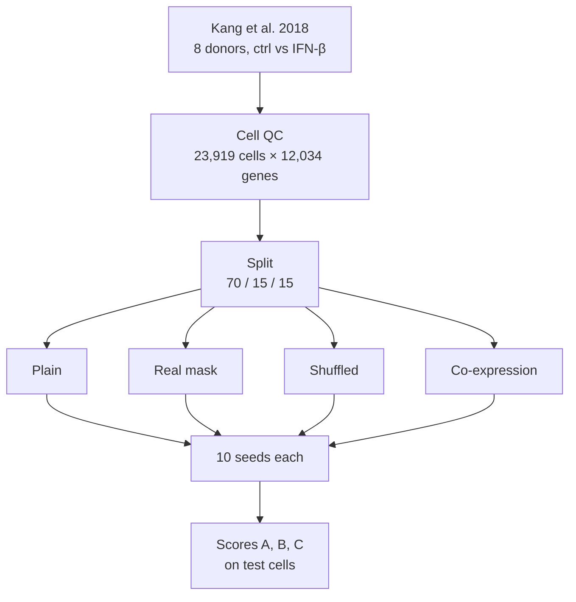
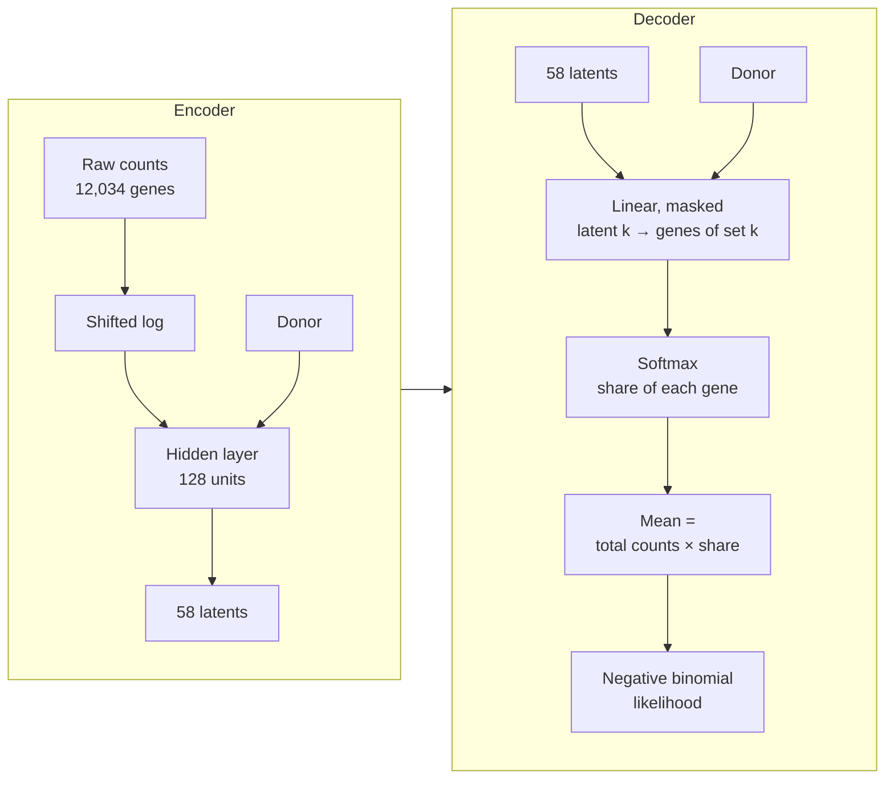

# Does prior knowledge help interpretable single-cell models?

Knowledge-guided single-cell models wire gene sets (pathways) into their architecture so that each latent factor reads
as a biological programme. For 29 *supervised* pathway-informed networks, structure-matched random pathways perform as
well as real ones [1]. This project asks the same question for *unsupervised* single-cell models, where it has not
been tested.

## Background
- **How knowledge enters a model** [2]: as input features (gene-set or TF-activity scores), as architecture (sparse or
  masked layers that mirror gene sets) or as a graph (networks over gene interactions). This project tests the
  architecture route, where "interpretable by design" is most direct: a masked linear decoder makes latent k the
  activity of gene set k, as in VEGA [3], expiMap [4] and pmVAE [5], and in linear factor models such as f-scLVM [6],
  PLIER [7] and Spectra [8].
- **The gap:** none of [3–8] includes a random-annotation control. KPNN [9] used shuffled networks, but in a supervised
  model; recent preprints corrupt part of each gene set [10] or have no random control [11].
- **Co-expression:** curated gene sets align with the main axes of expression more than size-matched random sets [12].
  A null built from co-expressed genes therefore separates "curated knowledge helps" from "any co-expressed group
  helps".
- **Data efficiency:** expiMap integrated subsampled PBMC data better than the linear-decoder VAE LDVAE [13] when
  trained on few cells [4], without a random-mask control and on integration quality rather than recovery of a known
  programme.
- **Benchmarking practice:** simple baselines and structure-preserving controls often match more complex or
  knowledge-based models [14–17], so every model here gets the same tuning budget and several seeds.

## Questions
- **Q1:** does the knowledge itself help, or only the sparsity a gene-set mask imposes? The known answer: IFN-β switches
  on the type I interferon programme.
- **Q1b:** is learning more data-efficient with real knowledge? Knowledge-guided models are argued to need fewer
  cells because they need not re-discover known patterns.

## Study design



Four variants share one architecture and differ only in the decoder mask:

| Variant | Decoder mask | Tests |
|---|---|---|
| Plain VAE (LDVAE [13]) | none | reference without knowledge |
| Real mask | Hallmark gene sets | knowledge + sparsity |
| Shuffled mask | Hallmark sets with gene labels permuted | sparsity alone |
| Co-expression | modules of co-expressed genes, same sizes | data-derived structure |

## Data
- **Dataset:** Kang et al. [18], GEO GSE96583 batch 2: PBMCs from 8 donors cultured for 6 h without (ctrl) or with
  IFN-β (stim), pooled in one 10x run per condition. Every donor appears in both conditions. The authors' count matrices,
  genotype-based (demuxlet) singlet calls and cell-type labels are used.
- **Cell QC** (following [19], with scanpy [20]): outliers beyond 5 median absolute deviations in log total counts, log
  detected genes or share of counts in the top 20 genes, with thresholds per condition × cell type. Thresholds per
  condition alone flagged up to 27% of monocytes, dendritic cells and megakaryocytes, whose RNA profiles differ from
  lymphocytes.
- **Genes:** detected in ≥ 20 cells. All 12,034 genes are modelled: selecting 5,000 highly variable genes drops
  interferon-induced genes such as PSMB9 and B2M and a third of the Hallmark interferon-α set
  (`notebooks/hvg_inspection.py`).
- **Result:** 24,673 labelled singlets → 23,919 cells (3.1% removed, 1–6% per cell type).
- **Split:** 70 / 15 / 15 train / validation / test within every donor × condition × cell type group.
- **Not applied:** ambient-RNA correction (no empty droplets are deposited) and a mitochondrial filter
  (mitochondrial genes have no counts in the deposited matrices).

## Gene sets and nulls
- **Hallmark** gene sets [21] (MSigDB v2024.1): 50 sets of ≥ 12 genes (median 117), no near-duplicates, and one
  unambiguous target, the interferon-α response (95 of its 97 genes present). Gene symbols are matched through
  Ensembl IDs to current HGNC symbols [22].
- **Shuffled masks:** gene labels are permuted within 25 expression bins, so every set keeps its size, its overlaps
  with other sets and its expression level; only its biology changes. 10 seeds.
- **Co-expression modules:** for each Hallmark set of size n, a random seed gene (detected in ≥ 1% of training cells)
  and its n − 1 most correlated genes, computed on training cells only. 10 seeds.

## Model



- **Linear decoder in every variant**, so each latent's effect on each gene is one weight and the mask is the only
  architectural difference.
- **Masked variants:** latents 1–50 may only use the genes of their set; 8 free latents may only use the 8,847 genes
  in no set (74%). Free latents reaching all genes absorb the stimulation signal and switch the named latents off.
- **Donor** is a covariate in encoder and decoder; condition is never a covariate.
- **Likelihood:** negative binomial on raw counts with a dispersion per gene and the observed total counts as library
  size; no zero inflation [23].
- **Training:** evidence lower bound with KL warm-up over ~38 epochs, Adam, batch 128, early stopping on validation loss
  (patience 3 epochs) [15]. Encoder width 128 (chosen on the plain VAE) and learning rate 1e-3 for
  every variant, so the mask is the only difference between variants. Seed k of the shuffled and co-expression
  variants uses mask k.

## Evaluation
- **Labels** never enter training. Validation labels choose latents for the variants without meaningful names and fit
  the regressions of scores B and C; test labels are used only for the final scores.
- **Score A (primary):** AUROC of stim vs ctrl for the interferon-α latent on test cells, within each cell type and
  averaged unweighted over 7 cell types. Megakaryocytes are excluded: they are mostly platelets, which have no nucleus.
- **Orientation:** a masked latent is oriented so that its mean weight on its own genes is positive. For the plain VAE
  and co-expression variants, the best of the 58 latents and its sign are chosen on validation cells.
- **Inactive latents** (variance of posterior means across validation cells ≤ 0.01) score 0.5.
- **Score B:** the interferon-α and -γ latents together (the two Hallmark sets share 71 of the α set's 95 genes); the
  best two latents for the variants without names.
- **Score C:** all 58 latents, separating information from interpretability.
- **Regression (B, C):** logistic regression on validation cells, standardised latents, L2 penalty (C = 1).
- **Statistics:** 10 seeds per variant, paired by seed. Primary test: score A, real vs shuffled; real beats shuffled
  if the 95% paired t-interval of the difference excludes 0, with a Wilcoxon signed-rank test alongside. All other
  comparisons are secondary.

## Learning curves (Q1b)
- **Training sizes:** 500, 1,000, 2,000, 4,000, 8,000 and all ~16,700 training cells; nested subsamples stratified by
  donor × condition × cell type. Validation and test sets stay fixed.
- **Training:** KL warm-up over 38 epochs, patience 3 epochs and learning rate 1e-3 at every size. All four variants,
  10 seeds per size.
- **Nulls:** co-expression modules and shuffle expression bins are rebuilt on each subsample.

## Future work
- **Q2:** do the explanations recover known regulators? In B cell → plasma cell differentiation PRDM1, IRF4 and XBP1
  go up and PAX5 and BACH2 go down; IRF4 and PRDM1 knockouts give perturbation ground truth [24, 25].
- **Q3:** does RNA-based pathway activity agree with CITE-seq surface protein, an independent measurement? RNA–protein
  correlation is weak, so protein is a noisy reference [25].
- **Q4:** the cost of incomplete or species-transferred gene sets, for example human sets applied to mouse
  gastrulation data [26], and whether a soft mask started from random sets refines to the same programmes.
- **Reactome** [27] as a second collection on the Kang data, as used there by [3, 4, 28].

| Question | Dataset | Access |
|---|---|---|
| Q1, Q1b | Kang et al. 2018 [18] | GEO GSE96583 (batch 2) |
| Q1, Q2 | Human tonsil atlas, B cell compartments [25] | Zenodo 10.5281/zenodo.8373756 |
| Q2 | B cell time course with IRF4 / PRDM1 CRISPR [24] | Zenodo 10.5281/zenodo.17984776 |
| Q3 | Tonsil CITE-seq [25]; 10x `pbmc_10k_protein_v3` | Zenodo 10.5281/zenodo.8373756; 10x Genomics |
| Q4 | Mouse gastrulation [26] | ArrayExpress E-MTAB-6967 |

## Reproducing

```
python3 -m venv .venv
.venv/bin/pip install -r requirements.txt
.venv/bin/python src/01_download_kang.py
.venv/bin/python src/02_download_genesets.py
.venv/bin/python src/03_preprocess_kang.py
.venv/bin/python src/04_build_masks.py
.venv/bin/python src/05_build_coexpression_null.py
bash src/07_experiment.sh
```

- `src/`: one script per stage in run order; `06_fit.py` trains one model per call and is run by `07_experiment.sh`.
- `notebooks/hvg_inspection.py`: highly-variable-gene analysis supporting the use of all genes.
- `data/`, `results/`: created by the scripts, not tracked.
- `reports/figures/`: figures.

## Status
Work in progress: preprocessing, gene-set masks and nulls are complete; results for Q1 and Q1b will be added here.

## References
1. Caranzano I, et al. Sparsity is all you need: rethinking biologically informed neural networks. *Brief Bioinform*
   (2026). [doi:10.1093/bib/bbag425](https://doi.org/10.1093/bib/bbag425)
2. Thapa K, et al. Strategies to include prior knowledge in omics analysis with deep neural networks. *Patterns*
   (2025). [doi:10.1016/j.patter.2025.101203](https://doi.org/10.1016/j.patter.2025.101203)
3. Seninge L, et al. VEGA is an interpretable generative model for inferring biological network activity in
   single-cell transcriptomics. *Nat Commun* (2021).
   [doi:10.1038/s41467-021-26017-0](https://doi.org/10.1038/s41467-021-26017-0)
4. Lotfollahi M, et al. Biologically informed deep learning to query gene programs in single-cell atlases.
   *Nat Cell Biol* (2023). [doi:10.1038/s41556-022-01072-x](https://doi.org/10.1038/s41556-022-01072-x)
5. Gut G, et al. pmVAE: learning interpretable single-cell representations with pathway modules. *bioRxiv* (2021).
   [doi:10.1101/2021.01.28.428664](https://doi.org/10.1101/2021.01.28.428664)
6. Buettner F, et al. f-scLVM: scalable and versatile factor analysis for single-cell RNA-seq. *Genome Biol* (2017).
   [doi:10.1186/s13059-017-1334-8](https://doi.org/10.1186/s13059-017-1334-8)
7. Mao W, et al. Pathway-level information extractor (PLIER) for gene expression data. *Nat Methods* (2019).
   [doi:10.1038/s41592-019-0456-1](https://doi.org/10.1038/s41592-019-0456-1)
8. Kunes RZ, et al. Supervised discovery of interpretable gene programs from single-cell data. *Nat Biotechnol*
   (2024). [doi:10.1038/s41587-023-01940-3](https://doi.org/10.1038/s41587-023-01940-3)
9. Fortelny N, Bock C. Knowledge-primed neural networks enable biologically interpretable deep learning on
   single-cell sequencing data. *Genome Biol* (2020).
   [doi:10.1186/s13059-020-02100-5](https://doi.org/10.1186/s13059-020-02100-5)
10. Qoku A, et al. MOFA-FLEX: a factor model framework for integrating omics data with prior knowledge. *bioRxiv*
    (2025). [doi:10.1101/2025.11.03.686250](https://doi.org/10.1101/2025.11.03.686250)
11. Moullet M, et al. Self-supervised learning for a gene program-centric view of cell states. *bioRxiv* (2026).
    [doi:10.64898/2026.03.24.713961](https://doi.org/10.64898/2026.03.24.713961)
12. Zhu Y, et al. A residual-ratio framework for auditing transcriptomic gene signatures against background
    expression structure. *bioRxiv* (2026). [doi:10.64898/2026.04.11.717907](https://doi.org/10.64898/2026.04.11.717907)
13. Svensson V, et al. Interpretable factor models of single-cell RNA-seq via variational autoencoders.
    *Bioinformatics* (2020). [doi:10.1093/bioinformatics/btaa169](https://doi.org/10.1093/bioinformatics/btaa169)
14. Villegas-Morcillo A, et al. Unsupervised protein embeddings outperform hand-crafted sequence and structure
    features at predicting molecular function. *Bioinformatics* (2021).
    [doi:10.1093/bioinformatics/btaa701](https://doi.org/10.1093/bioinformatics/btaa701)
15. Eltager M, et al. Benchmarking variational autoencoders on cancer transcriptomics data. *PLoS One* (2023).
    [doi:10.1371/journal.pone.0292126](https://doi.org/10.1371/journal.pone.0292126)
16. Makrodimitris S, et al. An in-depth comparison of linear and non-linear joint embedding methods for bulk and
    single-cell multi-omics. *Brief Bioinform* (2024). [doi:10.1093/bib/bbad416](https://doi.org/10.1093/bib/bbad416)
17. Ahlmann-Eltze C, et al. Deep-learning-based gene perturbation effect prediction does not yet outperform simple
    linear baselines. *Nat Methods* (2025). [doi:10.1038/s41592-025-02772-6](https://doi.org/10.1038/s41592-025-02772-6)
18. Kang HM, et al. Multiplexed droplet single-cell RNA-sequencing using natural genetic variation. *Nat Biotechnol*
    (2018). [doi:10.1038/nbt.4042](https://doi.org/10.1038/nbt.4042)
19. Heumos L, et al. Best practices for single-cell analysis across modalities. *Nat Rev Genet* (2023).
    [doi:10.1038/s41576-023-00586-w](https://doi.org/10.1038/s41576-023-00586-w)
20. Wolf FA, et al. SCANPY: large-scale single-cell gene expression data analysis. *Genome Biol* (2018).
    [doi:10.1186/s13059-017-1382-0](https://doi.org/10.1186/s13059-017-1382-0)
21. Liberzon A, et al. The Molecular Signatures Database (MSigDB) hallmark gene set collection. *Cell Syst* (2015).
    [doi:10.1016/j.cels.2015.12.004](https://doi.org/10.1016/j.cels.2015.12.004)
22. Seal RL, et al. Genenames.org: the HGNC resources in 2023. *Nucleic Acids Res* (2023).
    [doi:10.1093/nar/gkac888](https://doi.org/10.1093/nar/gkac888)
23. Svensson V. Droplet scRNA-seq is not zero-inflated. *Nat Biotechnol* (2020).
    [doi:10.1038/s41587-019-0379-5](https://doi.org/10.1038/s41587-019-0379-5)
24. Demela P, et al. Competing gene regulatory networks drive naive and memory B cell differentiation. *Mol Syst Biol*
    (2026). [doi:10.1038/s44320-026-00207-8](https://doi.org/10.1038/s44320-026-00207-8)
25. Massoni-Badosa R, et al. An atlas of cells in the human tonsil. *Immunity* (2024).
    [doi:10.1016/j.immuni.2024.01.006](https://doi.org/10.1016/j.immuni.2024.01.006)
26. Pijuan-Sala B, et al. A single-cell molecular map of mouse gastrulation and early organogenesis. *Nature* (2019).
    [doi:10.1038/s41586-019-0933-9](https://doi.org/10.1038/s41586-019-0933-9)
27. Milacic M, et al. The Reactome Pathway Knowledgebase 2024. *Nucleic Acids Res* (2024).
    [doi:10.1093/nar/gkad1025](https://doi.org/10.1093/nar/gkad1025)
28. Doncevic D, Herrmann C. Biologically informed variational autoencoders allow predictive modeling of genetic and
    drug-induced perturbations. *Bioinformatics* (2023).
    [doi:10.1093/bioinformatics/btad387](https://doi.org/10.1093/bioinformatics/btad387)
